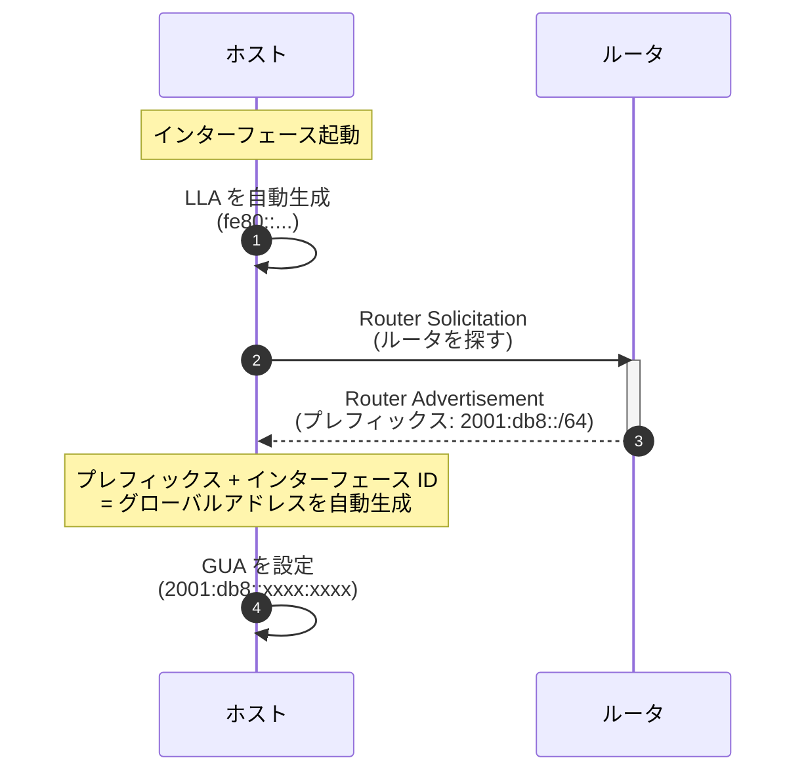
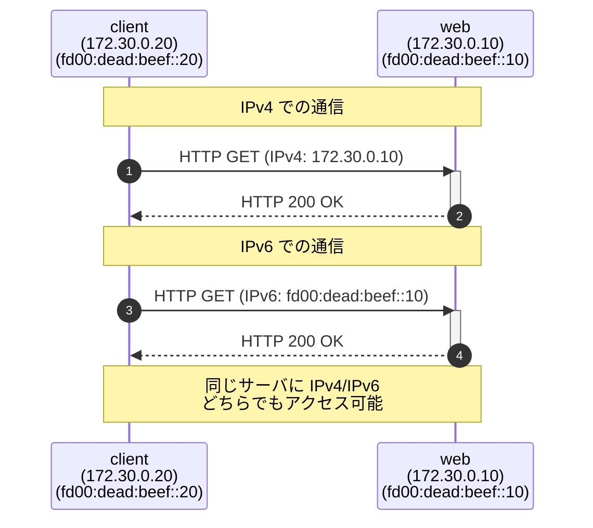
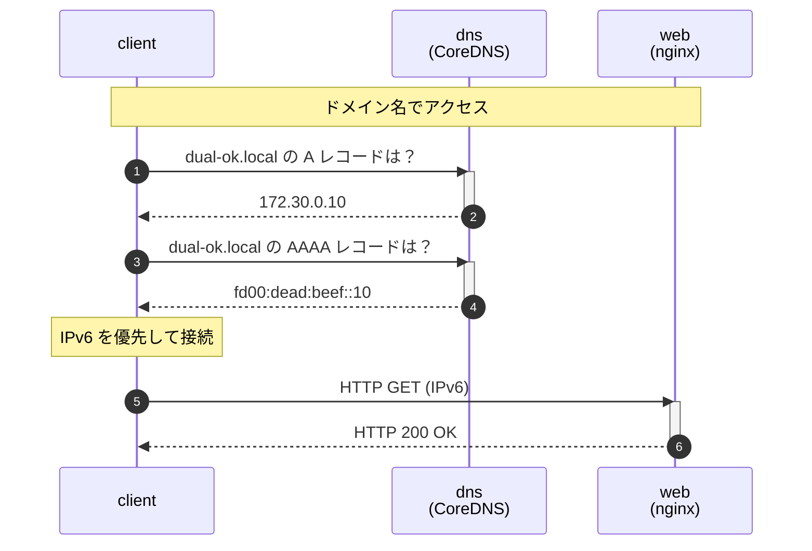
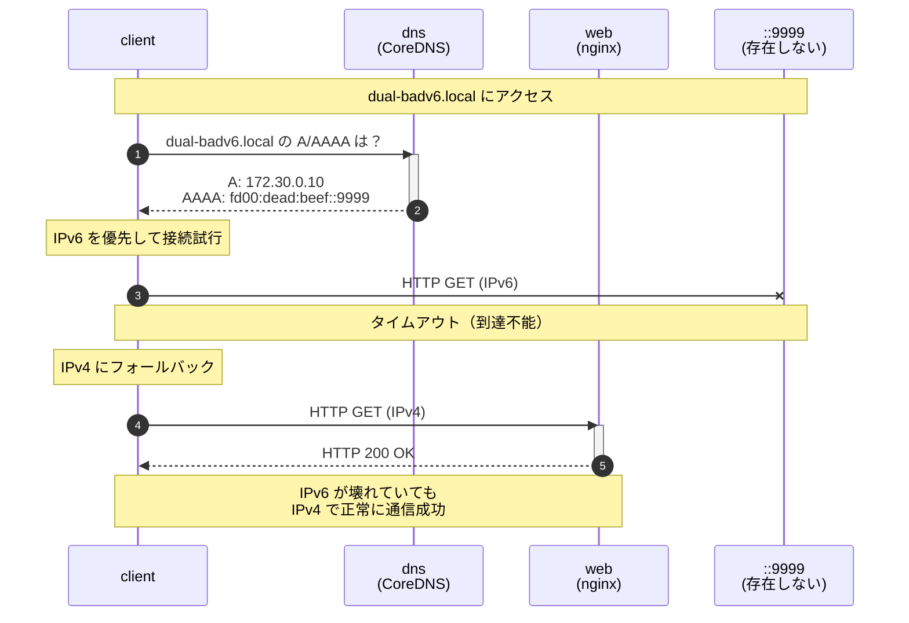
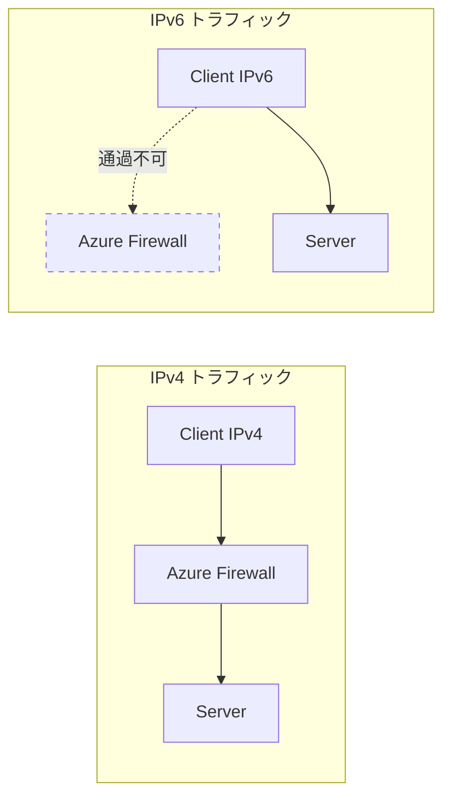

# はじめに

「IPv6 って聞いたことはあるけど、よくわからない」
「IPv4 で困っていないし、学ぶ必要があるのだろうか」

このように感じているエンジニアの方は、少なくないのではないでしょうか。

この記事は、**IPv6 の知識がまったくない**ジュニアエンジニアの方を対象に、Docker を使って IPv4 と IPv6 が共存する「**Dual Stack**」環境を実際に手を動かして体験していただくハンズオン記事です。

## この記事の目的

- IPv6 の**最低限の基礎知識**を身につける
- Docker で**ローカルに Dual Stack 環境**を構築する
- IPv4/IPv6 の疎通、DNS、**フォールバック動作**を体験する
- クラウド（Azure）での IPv6 設計につなげる

## 対象読者

- IPv6 を触ったことがないエンジニアの方
- ネットワークの基礎（IP アドレス、サブネット）は理解されている方
- Docker / Docker Compose が使える環境をお持ちの方

## 「Azure 閉域ネットワーク設計入門」との関係

この記事は「[Azure 閉域ネットワーク設計入門](https://zenn.dev/sbk0716/books/b39367c534044c)」の**補足コンテンツ**として作成しました。書籍では第 13 章で「IPv6 Dual Stack」を、Appendix F で「Azure サービス IPv6 対応状況」を解説しておりますが、Azure 固有の設計に踏み込む前に、まず **IPv6 そのものを体験**していただくことで理解が深まると考え、この記事を作成いたしました。

---

# なぜ今 IPv6 を学ぶのか

## IPv4 アドレスは「枯渇」している

IPv4 アドレスは約 **43 億個**しかありません。世界人口が 80 億人を超えた現在、1 人 1 アドレスすら割り当てることができない状況です。

### IPv4 枯渇の歴史

以下は、世界各地域で IPv4 アドレスプールが枯渇した日付です。

| 組織         | 枯渇日        | 地域                         | 備考                              |
| ------------ | ------------- | ---------------------------- | --------------------------------- |
| **IANA**     | 2011年2月3日  | 全世界（中央在庫）           | 最後の /8 ブロックを 5 RIR に分配 |
| **APNIC**    | 2011年4月15日 | アジア太平洋（日本含む）     | IANA 枯渇後わずか 2 ヶ月で枯渇    |
| **RIPE NCC** | 2012年9月14日 | ヨーロッパ、中東、中央アジア | 最後の /8 を使い切る              |
| **LACNIC**   | 2014年6月10日 | 中南米、カリブ海             | -                                 |
| **ARIN**     | 2015年9月24日 | 北米                         | 待機リスト制度を導入              |
| **AFRINIC**  | 2017年4月21日 | アフリカ                     | 最後に枯渇した RIR                |

> **出典**: [IANA IPv4 Address Space Registry](https://www.iana.org/assignments/ipv4-address-space/ipv4-address-space.xhtml)

### 現在の延命策とその問題点

現在は NAT（Network Address Translation）や CGNAT（Carrier-Grade NAT）で延命していますが、これらには以下の問題があります。

| 延命策        | 仕組み                                                | 問題点                                                 |
| ------------- | ----------------------------------------------------- | ------------------------------------------------------ |
| **NAT**       | プライベート IP をグローバル IP に変換                | End-to-End 通信が困難（P2P、VoIP、ゲームに影響）       |
| **CGNAT**     | ISP がさらに NAT を行い、複数ユーザーで同一 IP を共有 | IP ベースのアクセス制限が機能しない、ログ追跡が困難    |
| **IPv4 売買** | 未使用の IPv4 ブロックを売買                          | 価格が高騰（/24 で数万ドル）、中小企業には手が届かない |

## 大規模組織での課題

「自社では困っていない」と思われるかもしれません。しかし、以下のようなシナリオでは IPv4 の限界に直面することがあります。

| シナリオ               | 問題                                   | IPv6 での解決                 |
| ---------------------- | -------------------------------------- | ----------------------------- |
| **M&A（企業合併）**    | 両社が同じ 10.0.0.0/8 を使用 → IP 重複 | IPv6 なら重複しない設計が可能 |
| **マイクロサービス**   | Pod 数が数千規模で IP が不足           | 2^64 個のホストアドレス       |
| **IoT / スマート工場** | 数万台のセンサーに IP が必要           | 事実上無限のアドレス空間      |

### M&A での IP アドレス重複問題

企業が合併するとき、ネットワークも統合する必要があります。しかし、両社が同じプライベート IP アドレス空間を使っていた場合、深刻な問題が発生します。

```
【買収前】
  A社のネットワーク: 10.0.0.0/8 を使用
    - 社内サーバ: 10.1.1.0/24
    - 開発環境:   10.2.0.0/16

  B社のネットワーク: 10.0.0.0/8 を使用（同じアドレス空間！）
    - 社内サーバ: 10.1.1.0/24  ← A社と重複！
    - 本番環境:   10.3.0.0/16

【買収後の問題】
  - 10.1.1.1 にアクセスすると、A社？B社？
  - どちらかのネットワークを全面的に再設計する必要がある
  - 再設計には数ヶ月〜数年、多大なコストがかかる
```

### Kubernetes でのアドレス枯渇

マイクロサービスアーキテクチャでは、必要な IP アドレス数がモノリシックなアプリケーションと比べて桁違いに増加します。

```
【従来のモノリス】
  Web サーバ:  3 台 × 1 IP = 3 IP
  AP サーバ:   3 台 × 1 IP = 3 IP
  DB サーバ:   2 台 × 1 IP = 2 IP
  ─────────────────────────────
  合計:        8 IP アドレス

【マイクロサービス（Kubernetes）】
  認証サービス Pod:     10 個 × 1 IP = 10 IP
  商品サービス Pod:     20 個 × 1 IP = 20 IP
  注文サービス Pod:     30 個 × 1 IP = 30 IP
  ... 他 50 サービス ...
  ─────────────────────────────
  合計:        1000+ IP アドレス

  さらにオートスケール時は 2〜3 倍に増加！
```

## 「将来への備え」としての IPv6

IPv6 は**即効性のある解決策ではありません**。しかし、以下の理由から学んでおく価値があります。

### クラウドプロバイダーの対応状況

| プロバイダー | IPv6 対応 | 対応サービス                        | 備考                                      |
| ------------ | --------- | ----------------------------------- | ----------------------------------------- |
| **AWS**      | ✅ 充実    | VPC、ELB、CloudFront、S3、EC2 など  | IPv6-only サブネットもサポート            |
| **GCP**      | ✅ 充実    | VPC、Cloud Load Balancing、GCE など | Dual Stack が標準                         |
| **Azure**    | ⚠️ 一部    | VNet、NSG、Load Balancer            | **Azure Firewall が非対応**（重大な制約） |

### モバイル・IoT の動向

日本の携帯キャリアは、すでに IPv6 への移行を進めています。

| キャリア     | IPv6 対応状況                                 |
| ------------ | --------------------------------------------- |
| NTT ドコモ   | IPv6 シングルスタック（IPv4 は MAP-E で変換） |
| au (KDDI)    | IPv6 デュアルスタック                         |
| ソフトバンク | IPv6 デュアルスタック                         |
| 楽天モバイル | IPv6 デュアルスタック                         |

スマートフォンで Web サイトにアクセスすると、実は **IPv6 で通信していることが多い**のです。

## Dual Stack とは

1 つのネットワークインターフェースに IPv4 と IPv6 の**両方のアドレス**を割り当てる構成のことです。これにより、IPv4 でも IPv6 でも通信することができます。

```
【Dual Stack 構成のサーバ例】
eth0:
  IPv4: 192.168.1.10/24
  IPv6: 2001:db8::10/64

この場合、クライアントは IPv4 でも IPv6 でも
このサーバに接続することができます。

【Dual Stack のメリット】
- IPv4 しか対応していないクライアント → IPv4 で接続
- IPv6 対応のクライアント → IPv6 で接続（高速・効率的）
- 段階的な IPv6 移行が可能
```

---

# IPv6 の基礎（最小限）

ここでは、ハンズオンに必要な最低限の知識を解説いたします。

## IPv4 と IPv6 の違い

| 項目                 | IPv4          | IPv6               | 補足                    |
| -------------------- | ------------- | ------------------ | ----------------------- |
| **アドレス長**       | 32 ビット     | 128 ビット         | IPv6 は 4 倍の長さ      |
| **表記例**           | `192.168.1.1` | `2001:db8::1`      | IPv6 は 16 進数         |
| **アドレス数**       | 約 43 億      | 約 340 澗（10^38） | 事実上無限              |
| **NAT**              | 必要          | 不要（原則）       | End-to-End 通信が可能に |
| **自動設定**         | DHCP          | SLAAC / DHCPv6     | IPv6 は設定不要も可     |
| **ブロードキャスト** | あり          | **なし**           | マルチキャストで代替    |

## IPv6 アドレスの読み方

IPv6 アドレスは 16 進数で表記され、`:` で 8 つのブロックに区切られます。

### 完全表記と省略表記

```
【完全表記】
2001:0db8:0000:0000:0000:0000:0000:0001
 ↓↓↓↓  ↓↓↓↓  ↓↓↓↓  ↓↓↓↓  ↓↓↓↓  ↓↓↓↓  ↓↓↓↓  ↓↓↓↓
 16bit 16bit 16bit 16bit 16bit 16bit 16bit 16bit = 128bit

【省略表記】
2001:db8::1

【省略ルール】
1. 各ブロックの先頭の 0 は省略可能
   0db8 → db8
   0000 → 0
   0001 → 1

2. 連続する :0000: は :: で 1 回だけ省略可能
   :0000:0000:0000:0000:0000: → ::
```

### よくある間違い

```
【NG】連続する 0 を 2 回省略してはいけない
2001::1234::5678  ← どこに何個の 0 があるかわからなくなる

【OK】省略は 1 箇所だけ
2001::1234:0:0:5678  ← :: は 1 回だけ使用
```

## サブネットとプレフィックス

IPv4 ではサブネットマスク（例: `/24`）を使いますが、IPv6 でも同様にプレフィックス長を使用します。

```
【IPv4 の例】
192.168.1.0/24
  ├── ネットワーク部: 192.168.1（24 ビット）
  └── ホスト部:       .0〜.255（8 ビット = 256 アドレス）

【IPv6 の例】
fd00:dead:beef::/64
  ├── ネットワーク部: fd00:dead:beef:0000（64 ビット）
  └── ホスト部:       ::0000:0000:0000:0001〜（64 ビット = 約 1844 京アドレス）
```

> **なぜ /64 が標準なのか？**
> IPv6 では、インターフェース ID（ホスト部）に 64 ビットを割り当てるのが標準です。これは SLAAC（Stateless Address Autoconfiguration）で MAC アドレスから自動生成する仕組みに由来しています。

## IPv6 アドレスの種類

| 種類    | プレフィックス | 用途                         | IPv4 で例えると                |
| ------- | -------------- | ---------------------------- | ------------------------------ |
| **ULA** | `fd00::/8`     | プライベートネットワーク     | `10.0.0.0/8`, `192.168.0.0/16` |
| **GUA** | `2000::/3`     | グローバル（インターネット） | パブリック IP アドレス         |
| **LLA** | `fe80::/10`    | 同一リンク内のみ             | `169.254.0.0/16`（APIPA）      |

> **IPv6 のアドレス空間はどれくらい広い？**
> ```
> IPv4: 2^32  = 約 43 億（4.3 × 10^9）
> IPv6: 2^128 = 約 340 澗（3.4 × 10^38）
>
> IPv6 ÷ IPv4 = 約 7.9 × 10^28 倍
>
> これはどれくらいの数かというと...
> - 地球上のすべての砂粒（約 10^18）に IP アドレスを割り当てても余る
> - 太陽系のすべての原子に IP アドレスを割り当てられるレベル
> ```

### ULA（Unique Local Address）

今回のハンズオンでは **ULA** を使用します。

```
fd00:dead:beef:0000:0000:0000:0000:0010
│ │         │    │                    │
│ │         │    │                    └── インターフェース ID
│ │         │    └── サブネット ID
│ │         └── グローバル ID（ランダムに生成）
│ └── L ビット（1 = ローカル割り当て）
└── プレフィックス（fd = ULA）
```

> **なぜ dead:beef を使うのか？**
> `dead:beef` は 16 進数として有効で、覚えやすいため、テスト環境でよく使われます。

## SLAAC（自動アドレス設定）

IPv6 の大きな特徴の一つが、DHCP サーバなしでアドレスを自動設定できることです。

### LLA の役割

SLAAC では最初に LLA（リンクローカルアドレス）を生成します。これは**ルータと通信するため**です。グローバルアドレスを取得するにはルータに問い合わせる必要がありますが、ルータと通信するには何らかの IPv6 アドレスが必要です。LLA は MAC アドレスから自動生成できるため、この問題を解決できます。

```
【LLA 生成の例】
MAC アドレス: 02:42:ac:1e:00:14
      ↓ 変換
LLA: fe80::42:acff:fe1e:14
```

> **MAC アドレスから LLA を生成する仕組み（EUI-64）**
> 1. MAC アドレス（48 ビット）を前半と後半に分割: `02:42:ac` | `1e:00:14`
> 2. 間に `ff:fe` を挿入: `02:42:ac:ff:fe:1e:00:14`
> 3. 先頭バイトの第 7 ビット（U/L ビット）を反転: `02` → `00`
> 4. プレフィックス `fe80::` を付加: `fe80::42:acff:fe1e:14`
>
> この仕組みにより、DHCP なしでユニークなアドレスを生成できます。

### SLAAC の流れ

以下の図は、ホストがインターフェース起動からグローバルアドレス（GUA）取得までの流れを示しています。



**各ステップの詳細**:

1. **LLA 自動生成**: MAC アドレスから LLA を自動生成（管理者による IP 設定は不要）
2. **Router Solicitation**: LLA を送信元アドレスとして、ルータを探すメッセージを送信
3. **Router Advertisement**: ルータがネットワークのプレフィックス（例: `2001:db8::/64`）を通知
4. **GUA 生成**: プレフィックス + 自分の識別子 = グローバルに通信可能なアドレスを生成

## 今回使用するアドレス

このハンズオンでは、以下のアドレスを使用します。

| コンテナ        | IPv4        | IPv6（ULA）        |
| --------------- | ----------- | ------------------ |
| web (nginx)     | 172.30.0.10 | fd00:dead:beef::10 |
| dns (CoreDNS)   | 172.30.0.53 | fd00:dead:beef::53 |
| client (Alpine) | 172.30.0.20 | fd00:dead:beef::20 |

---

# ハンズオン環境の準備

ここからは、実際に手を動かして IPv6 Dual Stack を体験していきます。

## 必要なもの

| 項目                | 必須/推奨 | 説明                             |
| ------------------- | --------- | -------------------------------- |
| **Rancher Desktop** | 推奨      | 無料で商用利用可能な Docker 環境 |
| Docker Desktop      | 代替可    | 有料ライセンスが必要な場合あり   |
| Docker Compose      | 必須      | コンテナオーケストレーション     |
| ターミナル          | 必須      | bash または zsh                  |
| Git                 | 必須      | リポジトリのクローン用           |

> **なぜ Rancher Desktop を推奨するのか？**
> - **無料で商用利用可能**: Docker Desktop は従業員 250 名以上または年間売上 1,000 万ドル以上の企業で有料
> - **Docker 互換**: `dockerd (moby)` を Container Engine として選択すれば Docker と同じコマンドが使える

### 動作確認

```bash
# Docker が使えることを確認
docker --version
# 出力例: Docker version 24.0.7, build afdd53b

# Docker Compose が使えることを確認
docker compose version
# 出力例: Docker Compose version v2.23.0
```

## リポジトリのクローン

ハンズオン用のファイル一式を GitHub で公開しております。

```bash
# リポジトリをクローン
git clone https://github.com/sbk0716/rd-dualstack-lab.git

# ディレクトリに移動
cd rd-dualstack-lab
```

https://github.com/sbk0716/rd-dualstack-lab

## ファイル構成

```
rd-dualstack-lab/
├── README.md           # プロジェクトの説明
├── compose.yaml        # Docker Compose 設定（Dual Stack ネットワーク定義）
├── Corefile            # CoreDNS 設定（A/AAAA レコード定義）
├── start.sh            # 起動スクリプト
├── stop.sh             # 停止スクリプト
└── scripts/
    ├── ds_client.py        # Python フォールバックテスト
    ├── setup-client.sh     # クライアントセットアップ
    ├── test-connectivity.sh # 接続テスト
    └── test-fallback.sh    # フォールバックテスト
```

### 各ファイルの詳細

| ファイル         | 役割                                                           | 重要度 |
| ---------------- | -------------------------------------------------------------- | ------ |
| **compose.yaml** | Dual Stack ネットワークと 3 つのコンテナを定義                 | ⭐⭐⭐    |
| **Corefile**     | DNS サーバ（CoreDNS）の設定。A/AAAA レコードを定義             | ⭐⭐⭐    |
| **start.sh**     | 環境起動 + IPv6 有効確認 + IP アドレス表示                     | ⭐⭐     |
| **stop.sh**      | コンテナ・ネットワーク・ボリュームのクリーンアップ             | ⭐⭐     |
| **ds_client.py** | IPv6 → IPv4 フォールバックを詳細に観察できる Python スクリプト | ⭐⭐     |

## compose.yaml の解説

### ネットワーク設定（最重要）

```yaml
networks:
  dsnet:
    driver: bridge
    enable_ipv6: true  # ★重要★ IPv6 を有効化
    ipam:
      config:
        - subnet: 172.30.0.0/24      # IPv4 サブネット
        - subnet: fd00:dead:beef::/64 # IPv6 サブネット（ULA）
```

**ポイント**:
- `enable_ipv6: true` が最も重要な設定です。これがないと IPv6 アドレスが割り当てられません
- `fd00::/8` は ULA（Unique Local Address）と呼ばれる、プライベート IPv6 アドレス空間です

### コンテナ設定

```yaml
web:
  image: nginx:alpine
  container_name: rd-ds-web
  networks:
    dsnet:
      ipv4_address: 172.30.0.10
      ipv6_address: fd00:dead:beef::10
```

1 つのコンテナに **IPv4 と IPv6 の両方のアドレス**を割り当てています。これが Dual Stack の本質です。

### DNS サーバ（CoreDNS）の設定

```yaml
dns:
  image: coredns/coredns:1.11.1
  container_name: rd-ds-dns
  command: ["-conf", "/Corefile"]
  volumes:
    - ./Corefile:/Corefile:ro
  networks:
    dsnet:
      ipv4_address: 172.30.0.53
      ipv6_address: fd00:dead:beef::53
```

- A レコード（IPv4）と AAAA レコード（IPv6）の両方を返す DNS サーバです
- 設定は `Corefile` で定義しています

### テストクライアント（Alpine Linux）の設定

```yaml
client:
  image: alpine:3.20
  container_name: rd-ds-client
  command: ["sh", "-c", "sleep infinity"]
  depends_on:
    - web
    - dns
  dns:
    - 172.30.0.53
  networks:
    dsnet:
      ipv4_address: 172.30.0.20
      ipv6_address: fd00:dead:beef::20
```

- `sleep infinity` でコンテナを起動したままにしています
- `dns: - 172.30.0.53` で CoreDNS を DNS サーバとして使用
- このコンテナに `docker exec` で入ってテストを実施します

## Corefile（DNS 設定）

CoreDNS の設定ファイルです。A レコードと AAAA レコードを定義しています。

| ドメイン             | A レコード（IPv4） | AAAA レコード（IPv6）  | 用途                 |
| -------------------- | ------------------ | ---------------------- | -------------------- |
| **dual-ok.local**    | 172.30.0.10 ✅      | fd00:dead:beef::10 ✅   | 正常系テスト         |
| **dual-badv6.local** | 172.30.0.10 ✅      | fd00:dead:beef::9999 ❌ | フォールバックテスト |

`dual-badv6.local` は意図的に**到達不能な IPv6 アドレス**（`::9999`）を返します。これにより、Happy Eyeballs（IPv6/IPv4 フォールバック）の仕組みを体験できます。

### Corefile の内容

```
. {
  log
  errors
  hosts {
    # 正常系テスト用ドメイン
    172.30.0.10 dual-ok.local           # A レコード（IPv4）
    fd00:dead:beef::10 dual-ok.local    # AAAA レコード（IPv6）

    # IPv6 障害シミュレーション用ドメイン
    172.30.0.10 dual-badv6.local        # A レコード（IPv4）→ 正常
    fd00:dead:beef::9999 dual-badv6.local  # AAAA レコード（IPv6）→ 到達不能！

    fallthrough
  }
  forward . 1.1.1.1 8.8.8.8
}
```

- `log` / `errors`: ログ出力とエラー表示を有効化
- `hosts`: 静的な DNS レコードを定義
- `fallthrough`: hosts で見つからない場合は forward へ
- `forward . 1.1.1.1 8.8.8.8`: 外部 DNS へのフォワード

## 環境の構成図

```
┌─────────────────────────────────────────────────────────┐
│  dsnet (172.30.0.0/24, fd00:dead:beef::/64)             │
│                                                         │
│  ┌─────────┐    ┌─────────┐    ┌─────────────┐          │
│  │  web    │    │  dns    │    │   client    │          │
│  │ (nginx) │    │(CoreDNS)│    │  (alpine)   │          │
│  │         │    │         │    │             │          │
│  │ .0.10   │    │ .0.53   │    │   .0.20     │          │
│  │ ::10    │    │ ::53    │    │   ::20      │          │
│  └─────────┘    └─────────┘    └─────────────┘          │
└─────────────────────────────────────────────────────────┘
```

### コンテナ一覧

| コンテナ     | 役割                  | IPv4        | IPv6               |
| ------------ | --------------------- | ----------- | ------------------ |
| rd-ds-web    | Web サーバ（nginx）   | 172.30.0.10 | fd00:dead:beef::10 |
| rd-ds-dns    | DNS サーバ（CoreDNS） | 172.30.0.53 | fd00:dead:beef::53 |
| rd-ds-client | テストクライアント    | 172.30.0.20 | fd00:dead:beef::20 |

## 起動

```bash
./start.sh
```

以下のような出力が表示されれば成功です。

```
==========================================
Starting Dual Stack Lab...
==========================================

### Starting containers ###
[+] Running 4/4
 ✔ Network rd-dualstack-lab_dsnet  Created
 ✔ Container rd-ds-dns             Started
 ✔ Container rd-ds-web             Started
 ✔ Container rd-ds-client          Started

### Checking network configuration ###

IPv6 is ENABLED on dsnet network
```

---

# 実験 1: IPv4/IPv6 疎通確認

最初の実験では、Dual Stack 環境で **IPv4 と IPv6 の両方で通信できること** を確認します。

## クライアントコンテナに入る

```bash
docker exec -it rd-ds-client sh
```

> **docker exec とは？**
> 実行中のコンテナ内でコマンドを実行するための Docker コマンドです。
> - `-i`: 標準入力を開いたままにする（interactive）
> - `-t`: 疑似 TTY を割り当てる（terminal）
> - `sh`: 実行するコマンド（Alpine Linux のシェル）

## 必要なツールのインストール

```bash
apk add --no-cache curl bind-tools iputils python3
```

| パッケージ     | 含まれるコマンド | 用途                                 |
| -------------- | ---------------- | ------------------------------------ |
| **curl**       | curl             | HTTP リクエストの送信                |
| **bind-tools** | dig, nslookup    | DNS クエリの実行                     |
| **iputils**    | ping, ping6      | ICMP 疎通確認                        |
| **python3**    | python3          | フォールバックテストスクリプトの実行 |

## IPv4 で HTTP アクセス

```bash
curl -4 http://172.30.0.10/
```

nginx のウェルカムページが表示されれば成功です。

## IPv6 で HTTP アクセス

```bash
curl -6 -g http://[fd00:dead:beef::10]/
```

**オプションの説明**:
- `-6`: IPv6 のみを使用して接続
- `-g`: URL 内の `[]` をグロブとして解釈しない（IPv6 アドレスを含む URL で必要）

> **IPv6 アドレスを URL で指定する際の注意点**:
> IPv6 アドレスには `:` が含まれるため、ポート番号の区切り文字と区別できなくなります。そのため角括弧 `[]` で囲む必要があります。

## Ping で確認

```bash
# IPv4
ping -c 2 172.30.0.10

# IPv6
ping -c 2 fd00:dead:beef::10
```

**期待される出力（IPv4）**:

```
PING 172.30.0.10 (172.30.0.10) 56 data bytes
64 bytes from 172.30.0.10: icmp_seq=1 ttl=64 time=0.089 ms
64 bytes from 172.30.0.10: icmp_seq=2 ttl=64 time=0.156 ms

--- 172.30.0.10 ping statistics ---
2 packets transmitted, 2 received, 0% packet loss, time 1001ms
rtt min/avg/max/mdev = 0.089/0.122/0.156/0.033 ms
```

> **ping の結果の読み方**
> - `64 bytes from ...`: パケットが正常に返ってきた
> - `icmp_seq=1`: シーケンス番号（1 から順番に増加）
> - `ttl=64`: Time To Live（パケットが通過できるホップ数）
> - `time=0.089 ms`: 往復時間（RTT: Round Trip Time）
> - `0% packet loss`: パケットロスなし（すべて正常に通信）

両方とも `0% packet loss` なら成功です。

## コンテナの IP アドレスを確認

```bash
ip addr show eth0
```

**期待される出力**:

```
2: eth0: <BROADCAST,MULTICAST,UP,LOWER_UP> mtu 1500
    link/ether 02:42:ac:1e:00:14 brd ff:ff:ff:ff:ff:ff
    inet 172.30.0.20/24 brd 172.30.0.255 scope global eth0
    inet6 fd00:dead:beef::20/64 scope global nodad
    inet6 fe80::42:acff:fe1e:14/64 scope link
```

- `inet 172.30.0.20/24`: IPv4 アドレス
- `inet6 fd00:dead:beef::20/64 scope global`: IPv6 グローバル（ULA）アドレス
- `inet6 fe80::... scope link`: IPv6 リンクローカルアドレス（自動生成）

1 つのインターフェース（eth0）に **IPv4 と IPv6 の両方のアドレス**が割り当てられていることがわかります。これが Dual Stack です。

## 結果サマリ

| 確認項目    | IPv4                          | IPv6                                   | 結果               |
| ----------- | ----------------------------- | -------------------------------------- | ------------------ |
| HTTP 通信   | `curl -4 http://172.30.0.10/` | `curl -6 http://[fd00:dead:beef::10]/` | ✅ 両方成功         |
| ICMP 通信   | `ping 172.30.0.10`            | `ping fd00:dead:beef::10`              | ✅ 両方成功         |
| IP アドレス | 172.30.0.20                   | fd00:dead:beef::20                     | ✅ 両方割り当て済み |

**ポイント**:
- 1 つの Web サーバに **IPv4 でも IPv6 でもアクセスできる**
- 1 つのコンテナに **IPv4 と IPv6 の両方のアドレスが割り当てられている**
- これが **Dual Stack** の基本的な動作

## Dual Stack 疎通確認フロー

以下のシーケンス図は、クライアントから Web サーバへの IPv4/IPv6 通信の流れを示しています。



**各ステップの詳細**:

1. **IPv4 での通信**: クライアントが IPv4 アドレス（172.30.0.10）を指定して HTTP リクエストを送信
2. **IPv6 での通信**: クライアントが IPv6 アドレス（fd00:dead:beef::10）を指定して HTTP リクエストを送信
3. **同じサーバ**: どちらのリクエストも同じ nginx コンテナが処理し、同じレスポンスを返す

---

# 実験 2: DNS による名前解決

実験 1 では IP アドレスを直接指定してアクセスしましたが、実際のシステムでは**ドメイン名**を使うのが一般的です。

## A レコードと AAAA レコード

DNS には IPv4 用と IPv6 用の 2 種類のアドレスレコードがあります。

| レコード | 正式名称       | 用途                | 例                            |
| -------- | -------------- | ------------------- | ----------------------------- |
| **A**    | Address Record | IPv4 アドレスを返す | `example.com → 93.184.216.34` |
| **AAAA** | Quad-A Record  | IPv6 アドレスを返す | `example.com → 2606:2800:...` |

> **なぜ AAAA という名前なのか？**
> A レコードは 32 ビット、AAAA レコードは 128 ビット。128 ÷ 32 = 4 なので「A を 4 つ」→ AAAA

## dig コマンドで DNS を確認

### A レコード（IPv4）の確認

```bash
dig dual-ok.local A +short
```

**期待される出力**:

```
172.30.0.10
```

### AAAA レコード（IPv6）の確認

```bash
dig dual-ok.local AAAA +short
```

**期待される出力**:

```
fd00:dead:beef::10
```

### 詳細な DNS 応答を確認

`+short` オプションを外すと、DNS 応答の詳細が確認できます。

```bash
dig dual-ok.local A
```

**期待される出力**:

```
; <<>> DiG 9.18.x <<>> dual-ok.local A
;; global options: +cmd
;; Got answer:
;; WARNING: .local is reserved for Multicast DNS
;; ->>HEADER<<- opcode: QUERY, status: NOERROR, id: 12345
;; flags: qr aa rd; QUERY: 1, ANSWER: 1, AUTHORITY: 0, ADDITIONAL: 1

;; QUESTION SECTION:
;dual-ok.local.                 IN      A

;; ANSWER SECTION:
dual-ok.local.          3600    IN      A       172.30.0.10

;; Query time: 0 msec
;; SERVER: 127.0.0.11#53(127.0.0.11) (UDP)
;; MSG SIZE  rcvd: 70
```

> **dig 出力の読み方**
> - `status: NOERROR`: DNS クエリが成功
> - `ANSWER: 1`: 1 つの回答レコードが返された
> - `3600`: TTL（Time To Live）= 3600 秒（1 時間）キャッシュ可能
> - `IN A`: Internet クラスの A レコード
> - `SERVER: 127.0.0.11`: Docker の内部 DNS リゾルバが使用された

> **`.local` ドメインの WARNING について**
> `.local` は本来 mDNS（Multicast DNS）用に予約されたドメインです（RFC 6762）。今回はラボ環境のため `.local` を使用していますが、本番環境では `.internal` や `.lan` など別のドメインを使用することを推奨します。

### DNS サーバの確認

```bash
cat /etc/resolv.conf
```

**期待される出力**:

```
nameserver 127.0.0.11
options ndots:0

# ExtServers: [172.30.0.53]
```

> **127.0.0.11 とは？**
> Docker Engine の内部 DNS リゾルバです。コンテナからの DNS クエリは、このリゾルバが受け取り、`compose.yaml` で指定した DNS サーバ（`172.30.0.53` = CoreDNS）に転送されます。

## 名前でアクセスしてみる

```bash
curl -v http://dual-ok.local/
```

**期待される出力（抜粋）**:

```
* Host dual-ok.local:80 was resolved.
* IPv6: fd00:dead:beef::10
* IPv4: 172.30.0.10
*   Trying [fd00:dead:beef::10]:80...
* Connected to dual-ok.local (fd00:dead:beef::10) port 80
```

**IPv6 アドレスに接続しています！** curl は DNS から A レコードと AAAA レコードの両方を取得し、**IPv6 を優先**して接続を試みています。

### なぜ IPv6 が優先されるのか？

RFC 6724（Default Address Selection for Internet Protocol Version 6）で、IPv6 を優先することが推奨されています。

## IPv4 を強制して接続

```bash
curl -4 -v http://dual-ok.local/
```

**期待される出力（抜粋）**:

```
* Host dual-ok.local:80 was resolved.
* IPv6: (none)
* IPv4: 172.30.0.10
*   Trying 172.30.0.10:80...
* Connected to dual-ok.local (172.30.0.10) port 80
```

`-4` オプションにより IPv6 は解決されず、IPv4 アドレスのみに接続しています。

## 結果サマリ

| 確認項目              | 結果                                            |
| --------------------- | ----------------------------------------------- |
| A レコード（IPv4）    | `dig dual-ok.local A` → `172.30.0.10`           |
| AAAA レコード（IPv6） | `dig dual-ok.local AAAA` → `fd00:dead:beef::10` |
| ドメイン名でアクセス  | curl は **IPv6 を優先**して接続                 |
| IPv4 強制             | `curl -4` で IPv4 接続を強制可能                |

**ポイント**:
- DNS は **A レコード（IPv4）と AAAA レコード（IPv6）の両方** を返すことができる
- Dual Stack 対応のクライアント（curl など）は通常 **IPv6 を優先**して接続を試みる
- これは RFC 6724 で推奨されている動作

## DNS 名前解決フロー

以下のシーケンス図は、クライアントがドメイン名で Web サーバにアクセスする際の流れを示しています。



**各ステップの詳細**:

1. **A レコードクエリ**: クライアントが DNS サーバに IPv4 アドレスを問い合わせ
2. **AAAA レコードクエリ**: クライアントが DNS サーバに IPv6 アドレスを問い合わせ
3. **IPv6 優先**: 両方のアドレスを取得後、RFC 6724 に従い IPv6 を優先して接続
4. **HTTP 通信**: IPv6 アドレスで Web サーバにリクエストを送信し、レスポンスを受信

---

# 実験 3: IPv6 障害時のフォールバック

この実験は、Dual Stack の**真価**が発揮される場面です。**IPv6 が壊れたとき、自動的に IPv4 に切り替わるかどうか**を観察します。

## なぜフォールバックが重要なのか？

現実世界では、IPv6 が「壊れる」ことがあります。

| 障害パターン         | 原因                        | 発生頻度       |
| -------------------- | --------------------------- | -------------- |
| ルーティング障害     | ISP の IPv6 経路が不安定    | 比較的多い     |
| ファイアウォール設定 | IPv6 がブロックされている   | よくある       |
| 古いネットワーク機器 | IPv6 非対応または不完全     | 企業内では多い |
| 設定ミス             | AAAA レコードが間違っている | たまにある     |

フォールバック機能がなければ、IPv6 が壊れた時点で**通信不能**になってしまいます。

## 障害シミュレーション環境

| ドメイン         | A レコード（IPv4） | AAAA レコード（IPv6）  | 状態                |
| ---------------- | ------------------ | ---------------------- | ------------------- |
| dual-ok.local    | 172.30.0.10 ✅      | fd00:dead:beef::10 ✅   | 正常                |
| dual-badv6.local | 172.30.0.10 ✅      | fd00:dead:beef::9999 ❌ | **IPv6 が到達不能** |

`fd00:dead:beef::9999` は存在しないアドレスなので、パケットを送っても応答がありません。

## DNS で壊れた AAAA レコードを確認

```bash
# A レコード（IPv4）
dig dual-badv6.local A +short
# → 172.30.0.10（正常）

# AAAA レコード（IPv6）
dig dual-badv6.local AAAA +short
# → fd00:dead:beef::9999（到達不能）
```

## curl でフォールバックを観察

```bash
curl -v --connect-timeout 3 http://dual-badv6.local/
```

**期待される出力（抜粋）**:

```
* Host dual-badv6.local:80 was resolved.
* IPv6: fd00:dead:beef::9999
* IPv4: 172.30.0.10
*   Trying [fd00:dead:beef::9999]:80...
*   Trying 172.30.0.10:80...
* Connected to dual-badv6.local (172.30.0.10) port 80
< HTTP/1.1 200 OK
```

**観察ポイント**:

1. DNS から **A レコードと AAAA レコードの両方**を取得
2. まず **IPv6（::9999）への接続を試行**
3. IPv6 が応答しないため、**IPv4（172.30.0.10）にフォールバック**
4. IPv4 で**接続成功**

これが **フォールバック** の動作です。IPv6 が壊れていても、ユーザーには正常に Web ページが表示されます。

## Python で詳細に観察

curl は高速にフォールバックしますが、**何が起きているのか**をより詳細に観察するために、Python スクリプトを使用してみましょう。

```bash
# ホスト側で実行（コンテナの外）
docker cp scripts/ds_client.py rd-ds-client:/tmp/

# コンテナ内で実行
python3 /tmp/ds_client.py dual-badv6.local 80
```

**期待される出力**:

```
resolved: dual-badv6.local:80
  - IPv6 ('fd00:dead:beef::9999', 80, 0, 0)
  - IPv4 ('172.30.0.10', 80)
try IPv6: ('fd00:dead:beef::9999', 80, 0, 0) ...
failed via IPv6: timed out
try IPv4: ('172.30.0.10', 80) ...
connected via IPv4 in 0.8 ms
recv: HTTP/1.1 200 OK
```

**スクリプト出力の読み方**:

1. `resolved: dual-badv6.local:80` - DNS 名前解決が完了
2. `IPv6 ('fd00:dead:beef::9999', 80, 0, 0)` - AAAA レコードから取得した IPv6 アドレス
3. `IPv4 ('172.30.0.10', 80)` - A レコードから取得した IPv4 アドレス
4. `try IPv6:` - まず IPv6 での接続を試行
5. `failed via IPv6: timed out` - IPv6 接続がタイムアウト（到達不能）
6. `try IPv4:` - 次に IPv4 での接続を試行
7. `connected via IPv4 in 0.8 ms` - **IPv4 で接続成功**（往復 0.8ms）
8. `recv: HTTP/1.1 200 OK` - HTTP レスポンスを正常に受信

IPv6 タイムアウト後、IPv4 で接続成功しています。これが **フォールバック** の具体的な動作です。

### 正常系との比較

正常なドメイン（`dual-ok.local`）でも試してみましょう。

```bash
python3 /tmp/ds_client.py dual-ok.local 80
```

**期待される出力**:

```
resolved: dual-ok.local:80
  - IPv6 ('fd00:dead:beef::10', 80, 0, 0)
  - IPv4 ('172.30.0.10', 80)
try IPv6: ('fd00:dead:beef::10', 80, 0, 0) ...
connected via IPv6 in 0.5 ms
recv: HTTP/1.1 200 OK
```

正常な場合は IPv6 で即座に接続成功し、**フォールバック不要**であることがわかります。

## Happy Eyeballs とは

モダンなクライアント（ブラウザ、curl など）は「**Happy Eyeballs**」（RFC 8305）というアルゴリズムを実装しています。

### なぜ「Happy Eyeballs」という名前なのか？

「ユーザーの目を幸せにする」= 待ち時間を最小化する

```
【従来の問題】
1. IPv6 を優先して接続試行
2. IPv6 が壊れている → タイムアウトまで待つ（数秒〜数十秒）
3. ようやく IPv4 にフォールバック
4. ユーザー：「遅い！😢」

【Happy Eyeballs による解決】
1. IPv6 を優先して接続試行
2. 250ms 待っても応答がなければ IPv4 も並列で試行
3. 先に成功した方を使用
4. ユーザー：「速い！😊」
```

### RFC 8305 のポイント

| パラメータ                   | 推奨値 | 説明                                |
| ---------------------------- | ------ | ----------------------------------- |
| **Resolution Delay**         | 50ms   | A/AAAA 両方の名前解決を待つ時間     |
| **Connection Attempt Delay** | 250ms  | IPv6 の応答を待ってから IPv4 を試行 |

> 出典: [RFC 8305](https://datatracker.ietf.org/doc/html/rfc8305)

### どのクライアントが Happy Eyeballs を実装しているか？

| クライアント              | Happy Eyeballs | 備考              |
| ------------------------- | -------------- | ----------------- |
| Chrome / Firefox / Safari | ✅ RFC 8305     | 完全実装          |
| curl                      | ✅ RFC 8305     | 7.59.0 以降       |
| Python requests           | ⚠️ 部分的       | urllib3 依存      |
| Node.js                   | ⚠️ OS 依存      | dns.lookup() 依存 |

## 結果サマリ

| 確認項目           | 結果                                       |
| ------------------ | ------------------------------------------ |
| IPv6 障害時        | 自動的に IPv4 にフォールバック             |
| フォールバック時間 | curl: 250ms 以内                           |
| ユーザー体験       | IPv6 が壊れていても Web ページは表示される |

**ポイント**:
- IPv6 が壊れても、クライアントは**自動的に IPv4 にフォールバック**する
- これは「**Happy Eyeballs**」（RFC 8305）というアルゴリズムによるもの
- Dual Stack は**可用性**を高める設計パターンでもある
- ユーザーは IPv6 の障害に**気づかない**（これが理想的な動作）

## IPv6 フォールバックフロー

以下のシーケンス図は、IPv6 が到達不能な場合に IPv4 にフォールバックする流れを示しています。



**各ステップの詳細**:

1. **DNS クエリ**: A レコードと AAAA レコードを取得。AAAA は到達不能なアドレスを返す
2. **IPv6 接続試行**: RFC 6724 に従い IPv6 を優先して接続を試みる
3. **タイムアウト**: 到達不能なアドレスのため、接続がタイムアウト
4. **IPv4 フォールバック**: IPv6 が失敗したため、IPv4 で接続を試行
5. **通信成功**: IPv4 で正常に HTTP レスポンスを受信

---

# この実験から学んだこと

3 つの実験を通じて、IPv6 Dual Stack の基本的な動作を体験しました。

## 実験のまとめ

| 実験       | 確認したこと                    | 技術的なポイント            |
| ---------- | ------------------------------- | --------------------------- |
| **実験 1** | IPv4/IPv6 両方で通信可能        | Dual Stack の基本動作       |
| **実験 2** | DNS で A/AAAA レコードを返す    | IPv6 優先の名前解決         |
| **実験 3** | IPv6 障害時の自動フォールバック | Happy Eyeballs アルゴリズム |

## Dual Stack の本質

Dual Stack は単に「IPv4 と IPv6 の両方が使える」というだけではありません。**3 つの重要な価値**を提供します。

### 1. 移行戦略

```
【従来の移行アプローチ】
IPv4 のみ → 一斉に IPv6 へ切替 → リスクが高い

【Dual Stack による段階的移行】
IPv4 のみ → Dual Stack（両方対応）→ IPv6 のみ

Phase 1: IPv4 環境に IPv6 を追加（Dual Stack 化）
Phase 2: 新規クライアントは IPv6 優先
Phase 3: IPv4 クライアントが減少
Phase 4: IPv4 を廃止（必要に応じて）
```

### 2. 可用性（Redundancy）

```
【単一プロトコル】
IPv4 障害 → サービス停止 😢
IPv6 障害 → サービス停止 😢

【Dual Stack】
IPv4 障害 → IPv6 で継続 ✅
IPv6 障害 → IPv4 で継続 ✅

片方が壊れても、もう片方でサービス継続可能
```

### 3. 柔軟性

```
【クライアント別の対応】
- IPv6 対応クライアント → IPv6 で高速通信
- IPv4 のみクライアント → IPv4 で互換性確保
- モバイル（IPv6 優先）→ NAT なしで直接通信

サーバ側は Dual Stack にしておけば、
クライアントの状況に自動的に対応
```

## 学んだ技術用語の整理

| 用語               | 意味                                       | この実験での関連            |
| ------------------ | ------------------------------------------ | --------------------------- |
| **Dual Stack**     | IPv4 と IPv6 の両方を同時に使用する構成    | compose.yaml の enable_ipv6 |
| **ULA**            | プライベート IPv6 アドレス（fd00::/8）     | fd00:dead:beef::/64         |
| **A レコード**     | DNS で IPv4 アドレスを返すレコード         | dig dual-ok.local A         |
| **AAAA レコード**  | DNS で IPv6 アドレスを返すレコード         | dig dual-ok.local AAAA      |
| **Happy Eyeballs** | IPv6/IPv4 並列接続アルゴリズム（RFC 8305） | curl のフォールバック動作   |
| **フォールバック** | 優先手段が失敗時に代替手段に切り替えること | IPv6 → IPv4 切替            |

---

# Azure での IPv6

ここからは、**クラウド（Azure）での IPv6** について、現実的な制約と設計パターンをご紹介いたします。

## Azure の IPv6 対応状況

Azure は IPv6 に対応していますが、**サービスごとに対応状況が大きく異なります**。

### ネットワーク基盤

| サービス      | IPv6 対応 | Dual Stack | 備考                               |
| ------------- | --------- | ---------- | ---------------------------------- |
| **VNet**      | ✅         | ✅          | IPv6 アドレス空間を追加可能        |
| **Subnet**    | ✅         | ✅          | IPv4/IPv6 両方のアドレス範囲を設定 |
| **NSG**       | ✅         | -          | IPv6 ルールを記述可能              |
| **Public IP** | ✅         | ✅          | Standard SKU で Dual Stack 対応    |

### ロードバランシング

| サービス                | IPv6 対応 | 備考                |
| ----------------------- | --------- | ------------------- |
| **Azure Load Balancer** | ✅         | Standard SKU で対応 |
| **Application Gateway** | ✅         | v2 SKU で対応       |
| **Azure Front Door**    | ✅         | グローバル負荷分散  |

### 重要な制約

| サービス             | IPv6 対応 | 影響                              |
| -------------------- | --------- | --------------------------------- |
| **Azure Firewall**   | ❌         | **L7 フィルタリング不可**         |
| **Private Endpoint** | ❌         | **PaaS への閉域接続は IPv4 のみ** |
| **VPN Gateway**      | ❌         | **オンプレ接続は IPv4 のみ**      |

## 最大の制約: Azure Firewall

Azure Firewall が **IPv6 に対応していない** ことは、エンタープライズ設計において非常に大きな制約です。

**Microsoft Learn 公式ドキュメントからの引用（2026年1月時点）**:

> "**Azure Firewall doesn't currently support IPv6.** It can operate in a dual stack virtual network using only IPv4, but the firewall subnet must be IPv4-only."
>
> — [Azure IPv6 Overview - Microsoft Learn](https://learn.microsoft.com/azure/virtual-network/ip-services/ipv6-overview)

### Azure Firewall の制約を示す図

以下の図は、Azure Firewall が IPv4 トラフィックのみを処理でき、IPv6 トラフィックは通過できないことを示しています。



### 他のクラウドとの比較

| クラウド  | L7 ファイアウォール | IPv6 対応 | 対応開始時期 |
| --------- | ------------------- | --------- | ------------ |
| **AWS**   | Network Firewall    | ✅         | 2023年1月    |
| **GCP**   | Cloud Firewall      | ✅         | （初期から） |
| **Azure** | Azure Firewall      | ❌         | 未対応       |

## 現時点の推奨設計パターン

| パターン | 構成                       | メリット                  | デメリット            | 推奨度 |
| -------- | -------------------------- | ------------------------- | --------------------- | ------ |
| **A**    | IPv4 のみ + Azure Firewall | Azure Firewall のフル機能 | IPv6 非対応           | ⭐⭐⭐    |
| **B**    | Dual Stack + NSG のみ      | IPv6 対応                 | L7 フィルタリング不可 | ⭐⭐     |
| **C**    | Dual Stack + NVA           | IPv6 + L7 フィルタリング  | 高コスト、運用負荷    | ⭐      |

## より詳しく学ぶには

Azure での IPv6 設計について詳しく知りたい方は、「[Azure 閉域ネットワーク設計入門](https://zenn.dev/sbk0716/books/b39367c534044c)」の以下の章をご参照ください。

| 章             | 内容                                                   |
| -------------- | ------------------------------------------------------ |
| **第 13 章**   | IPv6 Dual Stack の設計パターン、Azure 固有の制約と対策 |
| **Appendix F** | Azure サービス IPv6 対応状況（全サービス一覧表）       |
| **Appendix K** | AWS/GCP との IPv6 対応比較                             |

---

# まとめ

お疲れさまでした！この記事では、Docker を使って IPv6 Dual Stack 環境を構築し、実際に手を動かして IPv6 の基本動作を体験しました。

## この記事で学んだこと

### 理論面

| トピック          | 学んだこと                                             |
| ----------------- | ------------------------------------------------------ |
| **IPv6 アドレス** | 128 ビット、16 進数表記、省略ルール                    |
| **アドレス種別**  | ULA（fd00::/8）、GUA（2000::/3）、LLA（fe80::/10）     |
| **DNS**           | A レコード（IPv4）、AAAA レコード（IPv6）              |
| **Dual Stack**    | 1 つのインターフェースに IPv4 と IPv6 の両方を割り当て |

### 実践面

| 実験       | 体験したこと         | 使ったコマンド                    |
| ---------- | -------------------- | --------------------------------- |
| **実験 1** | IPv4/IPv6 両方で通信 | `curl -4`, `curl -6`, `ping`      |
| **実験 2** | DNS 名前解決         | `dig A`, `dig AAAA`               |
| **実験 3** | フォールバック動作   | `curl -v`, `python3 ds_client.py` |

## Dual Stack の 3 つの価値

1. **移行戦略**: IPv4 → Dual Stack → IPv6 への段階的移行
2. **可用性**: 片方が壊れても、もう片方で継続
3. **柔軟性**: クライアントに応じて最適なプロトコルを選択

## 次のステップ

- [ ] このラボ環境で追加の実験を行う
- [ ] 「[Azure 閉域ネットワーク設計入門](https://zenn.dev/sbk0716/books/b39367c534044c)」の **第 13 章** で Azure での IPv6 設計を学ぶ
- [ ] Kubernetes での IPv6 Dual Stack を検証する

## 後片付け

```bash
# コンテナ内にいる場合は、まず exit でコンテナから出る
exit

# ラボ環境を停止・クリーンアップ
./stop.sh
```

IPv6 は「将来のための技術」ではなく、**すでに使われている技術**です。この記事が、IPv6 を学ぶ第一歩として役立てば幸いです。

---

# トラブルシューティング

ハンズオン中に問題が発生した場合の対処法をまとめます。

## IPv6 が有効になっていない

**症状**: `ping fd00:dead:beef::10` が失敗する

**確認方法**:

```bash
docker network inspect rd-dualstack-lab_dsnet | grep EnableIPv6
```

**対処法**:

```bash
# 環境を再作成
./stop.sh
./start.sh
```

## DNS 名前解決ができない

**症状**: `dig dual-ok.local A` がタイムアウトする

**確認方法**:

```bash
# DNS サーバのログを確認
docker logs rd-ds-dns
```

**対処法**:

1. CoreDNS コンテナが起動しているか確認: `docker ps`
2. Corefile の構文が正しいか確認
3. クライアントの `/etc/resolv.conf` を確認

## Rancher Desktop の特性

macOS 上の Rancher Desktop では、Docker は Linux VM 内で動作します。

```
┌─────────────────────────────────────────────────────────┐
│ macOS (Host)                                            │
│ ┌─────────────────────────────────────────────────────┐ │
│ │ Lima VM (Linux)                                     │ │
│ │ ┌─────────────────────────────────────────────────┐ │ │
│ │ │ Docker Engine                                   │ │ │
│ │ │ ┌─────────┐ ┌─────────┐ ┌─────────────┐         │ │ │
│ │ │ │  web    │ │  dns    │ │   client    │         │ │ │
│ │ │ └─────────┘ └─────────┘ └─────────────┘         │ │ │
│ │ └─────────────────────────────────────────────────┘ │ │
│ └─────────────────────────────────────────────────────┘ │
└─────────────────────────────────────────────────────────┘
```

**ポイント**:
- コンテナ間通信は VM 内で完結するため安定
- ホスト（macOS）からコンテナへの IPv6 通信は制限がある場合あり
- ハンズオンでは **コンテナ内から** テストを行うため問題なし

## Python スクリプトが見つからない

**症状**: `/tmp/ds_client.py: No such file or directory`

**対処法**:

```bash
# ホスト側で実行（コンテナの外）
docker cp scripts/ds_client.py rd-ds-client:/tmp/
```

---

# 参考リンク

## ハンズオン環境

https://github.com/sbk0716/rd-dualstack-lab

## 関連書籍

https://zenn.dev/sbk0716/books/b39367c534044c

## RFC（技術仕様）

| RFC                                                       | タイトル                            | 内容                     |
| --------------------------------------------------------- | ----------------------------------- | ------------------------ |
| [RFC 4193](https://datatracker.ietf.org/doc/html/rfc4193) | Unique Local IPv6 Unicast Addresses | ULA の定義               |
| [RFC 6724](https://datatracker.ietf.org/doc/html/rfc6724) | Default Address Selection for IPv6  | アドレス選択アルゴリズム |
| [RFC 8305](https://datatracker.ietf.org/doc/html/rfc8305) | Happy Eyeballs Version 2            | IPv4/IPv6 並列接続       |

## ドキュメント

| リソース                                                                                           | 説明                             |
| -------------------------------------------------------------------------------------------------- | -------------------------------- |
| [Azure IPv6 Overview](https://learn.microsoft.com/azure/virtual-network/ip-services/ipv6-overview) | Azure の IPv6 公式ドキュメント   |
| [Docker IPv6 Networking](https://docs.docker.com/config/daemon/ipv6/)                              | Docker での IPv6 設定            |
| [Test your IPv6](https://test-ipv6.com/)                                                           | あなたの環境が IPv6 対応かテスト |

---

# 付録: 公式ドキュメント引用集

## IPv4 アドレス枯渇

**出典**: [IANA IPv4 Address Space Registry](https://www.iana.org/assignments/ipv4-address-space/ipv4-address-space.xhtml)

## RFC 8305 - Happy Eyeballs Version 2

**Section 5 - Resolution Delay**:
> "The recommended value for the Resolution Delay is 50 milliseconds."

**Section 8 - Connection Attempt Delay**:
> "The recommended value for the Connection Attempt Delay is 250 milliseconds."
> "A Connection Attempt Delay MUST NOT be less than 100 ms, and SHOULD NOT be greater than 2 seconds."

**出典**: [RFC 8305](https://datatracker.ietf.org/doc/html/rfc8305)

## Azure IPv6 対応状況

> "Azure Firewall doesn't currently support IPv6. It can operate in a dual stack virtual network using only IPv4, but the firewall subnet must be IPv4-only."

**出典**: [Azure IPv6 Overview - Microsoft Learn](https://learn.microsoft.com/azure/virtual-network/ip-services/ipv6-overview)（2026年1月時点）

## AWS / GCP

> "AWS Network Firewall now supports IPv6, allowing customers to deploy the firewall in dual-stack VPCs."

**出典**: [AWS Network Firewall now supports IPv6](https://aws.amazon.com/about-aws/whats-new/2023/01/aws-network-firewall-supports-ipv6/)（2023年1月）

> "IPv6 connections are supported in VPC networks that have IPv6 enabled."

**出典**: [VPC firewall rules overview - Google Cloud](https://cloud.google.com/firewall/docs/firewalls)

---

> **注意**: 上記の情報は 2026年1月時点のものです。クラウドサービスの IPv6 対応状況は随時更新されるため、設計時には必ず最新の公式ドキュメントをご確認ください。
