# はじめに

「IPv6 って聞いたことはあるけど、よくわからない」
「IPv4 で困っていないし、学ぶ必要があるのだろうか」

このように感じているエンジニアの方は、少なくないのではないでしょうか。実は、私自身もそうでした。

この記事は、**IPv6 の知識がまったくない**ジュニアエンジニアの方を対象に、Docker を使って IPv4 と IPv6 が共存する「**Dual Stack**」環境を実際に手を動かして体験していただくハンズオン記事です。

## この記事の目的

- IPv6 の**最低限の基礎知識**を身につける
- Docker で**ローカルに Dual Stack 環境**を構築する
- IPv4/IPv6 の疎通、DNS、**フォールバック動作**を体験する
- クラウド（Azure）での IPv6 設計につなげる

## 対象読者

- IPv6 を触ったことがないエンジニアの方
- ネットワークの基礎（IP アドレス、サブネット）は理解されている方
- Docker / Docker Compose が使える環境をお持ちの方

## 「Azure 閉域ネットワーク設計入門」との関係

この記事は、私が執筆した Zenn 本「[Azure 閉域ネットワーク設計入門](https://zenn.dev/sbk0716/books/b39367c534044c)」の**補足コンテンツ**として作成しました。

この書籍では第 13 章で「IPv6 Dual Stack」を、Appendix F で「Azure サービス IPv6 対応状況」を解説しておりますが、Azure 固有の設計パターンに踏み込む前に、まず **IPv6 そのものを体験**していただくことで理解が深まると考え、この記事を作成いたしました。

```
この記事（IPv6 の基礎体験）
    ↓
書籍 第 13 章（Azure での IPv6 設計）
    ↓
書籍 Appendix F/K（制約事項と他クラウド比較）
```

---

# なぜ今 IPv6 を学ぶのか

## IPv4 アドレスは「枯渇」している

IPv4 アドレスは約 **43 億個**しかありません。世界人口が 80 億人を超えた現在、1 人 1 アドレスすら割り当てることができない状況です。

```
IPv4 アドレス数: 2^32 = 約 43 億個
世界人口:        約 80 億人
スマートフォン:  約 70 億台
IoT デバイス:    約 150 億台（2025 年予測では 270 億台）
```

### IPv4 枯渇の歴史

以下は、世界各地域で IPv4 アドレスプールが枯渇した正確な日付です。

| 組織      | 枯渇日          | 地域                      | 備考                           |
| --------- | --------------- | ------------------------- | ------------------------------ |
| **IANA**  | 2011年2月3日    | 全世界（中央在庫）        | 最後の /8 ブロックを 5 RIR に分配 |
| **APNIC** | 2011年4月15日   | アジア太平洋（日本含む）  | IANA 枯渇後わずか 2 ヶ月で枯渇  |
| **RIPE NCC** | 2012年9月14日 | ヨーロッパ、中東、中央アジア | 最後の /8 を使い切る          |
| **LACNIC** | 2014年6月10日  | 中南米、カリブ海          | -                              |
| **ARIN**  | 2015年9月24日   | 北米                      | 待機リスト制度を導入           |
| **AFRINIC** | 2017年4月21日 | アフリカ                  | 最後に枯渇した RIR             |

> **出典**: [IANA IPv4 Address Space Registry](https://www.iana.org/assignments/ipv4-address-space/ipv4-address-space.xhtml)

日本が属する APNIC は、IANA 枯渇からわずか 2 ヶ月後の 2011 年 4 月に枯渇しました。これは、アジア太平洋地域でのインターネット需要の急増を反映しています。

> **用語解説: RIR（Regional Internet Registry）とは？**
> IP アドレスを地域ごとに管理・分配する組織です。世界に 5 つあります。
> - **ARIN**: 北米
> - **RIPE NCC**: ヨーロッパ、中東、中央アジア
> - **APNIC**: アジア太平洋（日本はここ）
> - **LACNIC**: 中南米、カリブ海
> - **AFRINIC**: アフリカ

### 現在の延命策とその問題点

現在は NAT（Network Address Translation）や CGNAT（Carrier-Grade NAT）で延命していますが、これらには以下の問題があります:

| 延命策        | 仕組み                                                | 問題点                                                           |
| ------------- | ----------------------------------------------------- | ---------------------------------------------------------------- |
| **NAT**       | プライベート IP をグローバル IP に変換                | End-to-End 通信が困難になる（P2P、VoIP、オンラインゲームに影響） |
| **CGNAT**     | ISP がさらに NAT を行い、複数ユーザーで同一 IP を共有 | IP ベースのアクセス制限が機能しない、ログ追跡が困難              |
| **IPv4 売買** | 未使用の IPv4 ブロックを売買                          | 価格が高騰（/24 で数万ドル）、中小企業には手が届かない           |

## 大規模組織での課題

「自社では困っていない」と思われるかもしれません。しかし、以下のようなシナリオでは IPv4 の限界に直面することがあります。

### シナリオ 1: M&A（企業合併）

企業が合併するとき、ネットワークも統合する必要があります。しかし、両社が同じプライベート IP アドレス空間を使っていた場合、深刻な問題が発生します。

```
【買収前】
  A社のネットワーク: 10.0.0.0/8 を使用
    - 社内サーバ: 10.1.1.0/24
    - 開発環境:   10.2.0.0/16

  B社のネットワーク: 10.0.0.0/8 を使用（同じアドレス空間！）
    - 社内サーバ: 10.1.1.0/24  ← A社と重複！
    - 本番環境:   10.3.0.0/16

【買収後の問題】
  - 10.1.1.1 にアクセスすると、A社のサーバ？B社のサーバ？
  - どちらかのネットワークを全面的に再設計する必要がある
  - 再設計には数ヶ月〜数年、多大なコストがかかる
```

### シナリオ 2: マイクロサービス / Kubernetes

従来のモノリシックなアプリケーションと比べて、マイクロサービスアーキテクチャでは必要な IP アドレス数が桁違いに増加します。

```
【従来のモノリス】
  Web サーバ:  3 台 × 1 IP = 3 IP
  AP サーバ:   3 台 × 1 IP = 3 IP
  DB サーバ:   2 台 × 1 IP = 2 IP
  ─────────────────────────────
  合計:        8 IP アドレス

【マイクロサービス（Kubernetes）】
  認証サービス Pod:     10 個 × 1 IP = 10 IP
  商品サービス Pod:     20 個 × 1 IP = 20 IP
  注文サービス Pod:     30 個 × 1 IP = 30 IP
  決済サービス Pod:     10 個 × 1 IP = 10 IP
  通知サービス Pod:     10 個 × 1 IP = 10 IP
  ... 他 50 サービス ...
  ─────────────────────────────
  合計:        1000+ IP アドレス

  さらにオートスケール時は 2〜3 倍に増加！
```

Kubernetes のデフォルト Pod CIDR は `/16`（65,536 アドレス）ですが、大規模クラスタでは不足することがあります。

### シナリオ 3: IoT / スマート工場

製造業では、工場のスマート化に伴い、ネットワーク接続されるデバイスが爆発的に増加しています。

```
【スマート工場のネットワーク接続デバイス】
  温度・湿度センサー:  5,000 台
  振動センサー:        3,000 台
  画像検査カメラ:        500 台
  PLC（制御装置）:       500 台
  産業用ロボット:        100 台
  AGV（無人搬送車）:      50 台
  作業者タブレット:      300 台
  ─────────────────────────────
  合計:               9,450 IP アドレス

  将来の拡張（+工場増設）を考慮すると...
  /16（65,536 アドレス）でも心許ない
```

## 「将来への備え」としての Dual Stack

IPv6 は**即効性のある解決策ではありません**。しかし、以下の理由から「将来への備え」として学んでおく価値があると考えています。

### IPv6 のアドレス空間はどれくらい広い？

```
IPv4: 2^32  = 約 43 億（4.3 × 10^9）
IPv6: 2^128 = 約 340 澗（3.4 × 10^38）

比較するとこうなります:
─────────────────────────────
IPv6 アドレス数 ÷ IPv4 アドレス数 = 約 7.9 × 10^28

これはどれくらいの数かというと...
- 地球上のすべての砂粒（約 10^18）に IP アドレスを割り当てても余る
- 太陽系のすべての原子に IP アドレスを割り当てられるレベル
```

### クラウドプロバイダーの対応状況

| プロバイダー | IPv6 対応 | 対応サービス                        | 備考                                      |
| ------------ | --------- | ----------------------------------- | ----------------------------------------- |
| **AWS**      | ✅ 充実    | VPC、ELB、CloudFront、S3、EC2 など  | IPv6-only サブネットもサポート            |
| **GCP**      | ✅ 充実    | VPC、Cloud Load Balancing、GCE など | Dual Stack が標準                         |
| **Azure**    | ⚠️ 一部    | VNet、NSG、Load Balancer            | **Azure Firewall が非対応**（重大な制約） |

### モバイル・IoT の動向

日本の携帯キャリアは、すでに IPv6 への移行を完了しています。

| キャリア     | IPv6 対応状況                                 |
| ------------ | --------------------------------------------- |
| NTT ドコモ   | IPv6 シングルスタック（IPv4 は MAP-E で変換） |
| au (KDDI)    | IPv6 デュアルスタック                         |
| ソフトバンク | IPv6 デュアルスタック                         |
| 楽天モバイル | IPv6 デュアルスタック                         |

スマートフォンで Web サイトにアクセスすると、実は IPv6 で通信していることが多いのです。

> **Dual Stack とは？**
> 1 つのネットワークインターフェースに IPv4 と IPv6 の**両方のアドレス**を割り当てる構成のことです。これにより、IPv4 でも IPv6 でも通信することができます。

```
【Dual Stack 構成のサーバ例】
  eth0:
    IPv4: 192.168.1.10/24
    IPv6: 2001:db8::10/64

この場合、クライアントは IPv4 でも IPv6 でも
このサーバに接続することができます。

【Dual Stack のメリット】
  - IPv4 しか対応していないクライアント → IPv4 で接続
  - IPv6 対応のクライアント → IPv6 で接続（高速・効率的）
  - 段階的な IPv6 移行が可能
```

---

# IPv6 の基礎（最小限）

ここでは、ハンズオンに必要な最低限の知識を解説いたします。IPv6 を初めて学ぶ方にもわかりやすいよう、IPv4 との比較を交えながら説明します。

## IPv4 と IPv6 の違い

まず、IPv4 と IPv6 の主な違いを確認しましょう。

| 項目                 | IPv4                  | IPv6                 | 補足                    |
| -------------------- | --------------------- | -------------------- | ----------------------- |
| **アドレス長**       | 32 ビット             | 128 ビット           | IPv6 は 4 倍の長さ      |
| **表記例**           | `192.168.1.1`         | `2001:db8::1`        | IPv6 は 16 進数         |
| **アドレス数**       | 約 43 億              | 約 340 澗（10^38）   | 事実上無限              |
| **NAT**              | 必要                  | 不要（原則）         | End-to-End 通信が可能に |
| **自動設定**         | DHCP                  | SLAAC / DHCPv6       | IPv6 は設定不要も可     |
| **ヘッダ長**         | 可変（20〜60 バイト） | 固定（40 バイト）    | 処理が高速化            |
| **チェックサム**     | あり                  | なし（上位層で処理） | 処理が高速化            |
| **ブロードキャスト** | あり                  | **なし**             | マルチキャストで代替    |
| **フラグメント**     | ルータでも可能        | 送信元のみ           | 効率的なルーティング    |

> **ポイント: NAT が不要になる？**
> IPv4 では、プライベート IP アドレスからインターネットに接続するために NAT（Network Address Translation）が必要でした。しかし IPv6 ではアドレス空間が十分に広いため、すべてのデバイスにグローバルアドレスを割り当てることができます。これにより、End-to-End での直接通信が可能になります。

## IPv6 アドレスの読み方

IPv6 アドレスは 16 進数で表記され、`:` で 8 つのブロックに区切られます。各ブロックは 16 ビット（4 桁の 16 進数）です。

### 完全表記と省略表記

```
【完全表記】
2001:0db8:0000:0000:0000:0000:0000:0001
 ↓↓↓↓  ↓↓↓↓  ↓↓↓↓  ↓↓↓↓  ↓↓↓↓  ↓↓↓↓  ↓↓↓↓  ↓↓↓↓
 16bit 16bit 16bit 16bit 16bit 16bit 16bit 16bit = 128bit

【省略表記】
2001:db8::1

【省略ルール】
1. 各ブロックの先頭の 0 は省略可能
   0db8 → db8
   0000 → 0
   0001 → 1

2. 連続する :0000: は :: で 1 回だけ省略可能
   :0000:0000:0000:0000:0000: → ::
```

### よくある間違い

```
【NG】連続する 0 を 2 回省略してはいけない
2001::1234::5678  ← どこに何個の 0 があるかわからなくなる

【OK】省略は 1 箇所だけ
2001::1234:0:0:5678  ← :: は 1 回だけ使用
```

### 実際の例

```
【ループバックアドレス】
IPv4: 127.0.0.1
IPv6: ::1  ← 0000:0000:0000:0000:0000:0000:0000:0001 の省略形

【ドキュメント用アドレス（例示用）】
IPv6: 2001:db8::/32  ← RFC 3849 で定義されている例示用アドレス
                       (実際のネットワークでは使用しない)
```

## サブネットとプレフィックス

IPv4 ではサブネットマスク（例: `/24`）を使いますが、IPv6 でも同様にプレフィックス長を使用します。

```
【IPv4 の例】
192.168.1.0/24
  ├── ネットワーク部: 192.168.1（24 ビット）
  └── ホスト部:       .0〜.255（8 ビット = 256 アドレス）

【IPv6 の例】
fd00:dead:beef::/64
  ├── ネットワーク部: fd00:dead:beef:0000（64 ビット）
  └── ホスト部:       ::0000:0000:0000:0001〜（64 ビット = 約 1844 京アドレス）
```

> **なぜ /64 が標準なのか？**
> IPv6 では、インターフェース ID（ホスト部）に 64 ビットを割り当てるのが標準です。これは SLAAC（Stateless Address Autoconfiguration）で MAC アドレスから自動生成する仕組みに由来しています。

## IPv6 アドレスの種類

IPv6 には用途別に複数の種類のアドレスがあります。IPv4 のプライベートアドレス・グローバルアドレスに相当するものを理解しましょう。

| 種類                              | プレフィックス                    | 用途                         | IPv4 で例えると                |
| --------------------------------- | --------------------------------- | ---------------------------- | ------------------------------ |
| **ULA**（Unique Local Address）   | `fc00::/7`（実用上は `fd00::/8`） | プライベートネットワーク     | `10.0.0.0/8`, `192.168.0.0/16` |
| **GUA**（Global Unicast Address） | `2000::/3`                        | グローバル（インターネット） | パブリック IP アドレス         |
| **LLA**（Link-Local Address）     | `fe80::/10`                       | 同一リンク内のみ             | `169.254.0.0/16`（APIPA）      |
| **マルチキャスト**                | `ff00::/8`                        | 一対多通信                   | `224.0.0.0/4`                  |

### ULA（Unique Local Address）の詳細

今回のハンズオンでは **ULA** を使用します。ULA は以下の構造を持っています。

```
fd00:dead:beef:0000:0000:0000:0000:0010
│ │         │    │                    │
│ │         │    │                    └── インターフェース ID
│ │         │    └── サブネット ID
│ │         └── グローバル ID（ランダムに生成）
│ └── L ビット（1 = ローカル割り当て）
└── プレフィックス（fd = ULA）

【fd00:dead:beef::/64 の意味】
- fd: ULA（プライベート）であることを示す
- 00:dead:beef: グローバル ID（組織を識別）
- /64: サブネットプレフィックス長
```

> **なぜ dead:beef を使うのか？**
> `dead:beef` は 16 進数として有効で、覚えやすいため、テスト環境でよく使われます。実際には、ULA のグローバル ID は [RFC 4193](https://datatracker.ietf.org/doc/html/rfc4193) に従ってランダムに生成すべきです。

### LLA（Link-Local Address）について

LLA はルータを超えて通信することができませんが、非常に重要な役割を持っています。

```
【LLA の用途】
- 隣接ノードの発見（Neighbor Discovery Protocol）
- ルータの発見（Router Advertisement）
- DHCPv6 サーバとの通信
- IPv6 自動設定の基盤

【特徴】
- すべての IPv6 インターフェースに自動で割り当てられる
- 設定なしで同一リンク内の他のノードと通信可能
- fe80:: で始まる
```

## SLAAC（自動アドレス設定）

IPv6 の大きな特徴の一つが、DHCP サーバなしでアドレスを自動設定できることです。

```mermaid
sequenceDiagram
    autonumber
    participant Host as ホスト
    participant Router as ルータ

    Note over Host: インターフェース起動
    Host->>Host: LLA を自動生成<br/>(fe80::...)

    Host->>Router: Router Solicitation<br/>(ルータを探す)
    activate Router
    Router-->>Host: Router Advertisement<br/>(プレフィックス: 2001:db8::/64)
    deactivate Router

    Note over Host: プレフィックス + インターフェース ID<br/>= グローバルアドレスを自動生成

    Host->>Host: GUA を設定<br/>(2001:db8::xxxx:xxxx)
```



> **SLAAC vs DHCPv6**
> - **SLAAC**: ルータからプレフィックスを受け取り、ホストが自分でアドレスを生成
> - **DHCPv6**: IPv4 の DHCP と同様に、サーバからアドレスを割り当て
> - 両方を組み合わせることも可能（SLAAC でアドレス、DHCPv6 で DNS 情報など）

## ICMPv6 と Neighbor Discovery

IPv6 では、IPv4 の ARP（Address Resolution Protocol）に相当する機能が ICMPv6 の一部として実装されています。これを **Neighbor Discovery Protocol（NDP）** と呼びます。

| IPv4                  | IPv6（NDP）                                    | 機能                  |
| --------------------- | ---------------------------------------------- | --------------------- |
| ARP                   | Neighbor Solicitation / Neighbor Advertisement | IP → MAC アドレス解決 |
| ICMP Router Discovery | Router Solicitation / Router Advertisement     | ルータの発見          |
| ICMP Redirect         | Redirect                                       | より良い経路の通知    |
| なし                  | Duplicate Address Detection（DAD）             | アドレス重複の検出    |

> **なぜ ARP がなくなったのか？**
> IPv4 の ARP はブロードキャストを使用しますが、IPv6 ではブロードキャストが廃止されました。代わりに、効率的なマルチキャストを使用する NDP が導入されています。

## 今回使用するアドレス

このハンズオンでは、以下のアドレスを使用します。

| コンテナ        | IPv4        | IPv6（ULA）        |
| --------------- | ----------- | ------------------ |
| web (nginx)     | 172.30.0.10 | fd00:dead:beef::10 |
| dns (CoreDNS)   | 172.30.0.53 | fd00:dead:beef::53 |
| client (Alpine) | 172.30.0.20 | fd00:dead:beef::20 |

```
【ネットワーク構成】
IPv4 サブネット: 172.30.0.0/24   → 254 個のホストアドレス
IPv6 サブネット: fd00:dead:beef::/64 → 約 1844 京個のホストアドレス
```

---

# ハンズオン環境の準備

ここからは、実際に手を動かして IPv6 Dual Stack を体験していきます。Docker を使って、ローカル環境に完全な Dual Stack ネットワークを構築します。

## 必要なもの

| 項目                | 必須/推奨 | 説明                             |
| ------------------- | --------- | -------------------------------- |
| **Rancher Desktop** | 推奨      | 無料で商用利用可能な Docker 環境 |
| Docker Desktop      | 代替可    | 有料ライセンスが必要な場合あり   |
| Docker Compose      | 必須      | コンテナオーケストレーション     |
| ターミナル          | 必須      | bash または zsh                  |
| Git                 | 必須      | リポジトリのクローン用           |

> **なぜ Rancher Desktop を推奨するのか？**
> - **無料で商用利用可能**: Docker Desktop は従業員 250 名以上または年間売上 1,000 万ドル以上の企業で有料
> - **オープンソース**: 完全にオープンソースで開発されている
> - **Docker 互換**: `dockerd (moby)` を Container Engine として選択すれば Docker と同じコマンドが使える
> - **Kubernetes 内蔵**: 必要に応じて K8s 環境も利用可能

### Rancher Desktop のセットアップ

初めて Rancher Desktop を使用される方は、以下の手順で設定してください。

```
【Rancher Desktop 初期設定】

1. Rancher Desktop を起動

2. Preferences（設定）を開く
   - macOS: メニューバー → Rancher Desktop → Preferences
   - Windows: システムトレイ → Rancher Desktop → Settings

3. Container Engine を設定
   - Container Engine: dockerd (moby) を選択  ← 重要！
   - containerd を選択すると docker コマンドが使えません

4. 設定を保存して再起動
```

### 動作確認

Rancher Desktop（または Docker Desktop）が正しく設定されているか確認します。

```bash
# Docker が使えることを確認
docker --version
# 出力例: Docker version 24.0.7, build afdd53b

# Docker Compose が使えることを確認
docker compose version
# 出力例: Docker Compose version v2.23.0

# Docker デーモンが動作していることを確認
docker info | grep "Server Version"
# 出力例: Server Version: 24.0.7
```

## リポジトリのクローン

ハンズオン用のファイル一式を GitHub で公開しております。

```bash
# リポジトリをクローン
git clone https://github.com/sbk0716/rd-dualstack-lab.git

# ディレクトリに移動
cd rd-dualstack-lab

# ファイル一覧を確認
ls -la
```

https://github.com/sbk0716/rd-dualstack-lab

## ファイル構成

クローンしたリポジトリの構成を確認しましょう。各ファイルの役割を理解しておくと、実験がスムーズに進みます。

```
rd-dualstack-lab/
├── README.md           # プロジェクトの説明
├── article.md          # この記事のソース（Zenn テックブログ）
├── compose.yaml        # Docker Compose 設定（Dual Stack ネットワーク定義）
├── Corefile            # CoreDNS 設定（A/AAAA レコード定義）
├── start.sh            # 起動スクリプト（環境構築 + 確認）
├── stop.sh             # 停止スクリプト（クリーンアップ）
├── docs/
│   └── test-report.md  # テスト結果レポート
└── scripts/
    ├── ds_client.py        # Python フォールバックテスト
    ├── setup-client.sh     # クライアントセットアップ
    ├── test-connectivity.sh # 接続テスト
    └── test-fallback.sh    # フォールバックテスト
```

### 各ファイルの詳細

| ファイル         | 役割                                                           | 重要度 |
| ---------------- | -------------------------------------------------------------- | ------ |
| **compose.yaml** | Dual Stack ネットワークと 3 つのコンテナを定義                 | ⭐⭐⭐    |
| **Corefile**     | DNS サーバ（CoreDNS）の設定。A/AAAA レコードを定義             | ⭐⭐⭐    |
| **start.sh**     | 環境起動 + IPv6 有効確認 + IP アドレス表示                     | ⭐⭐     |
| **stop.sh**      | コンテナ・ネットワーク・ボリュームのクリーンアップ             | ⭐⭐     |
| **ds_client.py** | IPv6 → IPv4 フォールバックを詳細に観察できる Python スクリプト | ⭐⭐     |

## compose.yaml の解説

Dual Stack 環境を構築するための Docker Compose 設定ファイルです。各設定項目について詳しく解説いたします。

### ネットワーク設定（最重要）

```yaml
networks:
  dsnet:
    # ブリッジドライバを使用（Docker のデフォルト）
    driver: bridge
    # ★重要★ IPv6 を有効化（デフォルトは false）
    enable_ipv6: true
    # IPAM: IP アドレスの割り当て設定
    ipam:
      config:
        # IPv4 サブネット
        - subnet: 172.30.0.0/24
        # IPv6 サブネット（ULA = プライベート IPv6）
        - subnet: fd00:dead:beef::/64
```

**ポイント**:
- `enable_ipv6: true` が最も重要な設定です。これがないと IPv6 アドレスが割り当てられません
- `fd00::/8` は ULA（Unique Local Address）と呼ばれる、プライベート IPv6 アドレス空間です
- `/64` は IPv6 の標準的なサブネットサイズです（2^64 個のアドレスが使用可能）

### Web サーバ（nginx）

```yaml
web:
  image: nginx:alpine
  container_name: rd-ds-web
  networks:
    dsnet:
      # IPv4 と IPv6 の両方のアドレスを固定割り当て
      ipv4_address: 172.30.0.10
      ipv6_address: fd00:dead:beef::10
```

**ポイント**:
- 1 つのコンテナに **IPv4 と IPv6 の両方のアドレス**を割り当てています
- これが Dual Stack の本質です

### DNS サーバ（CoreDNS）

```yaml
dns:
  image: coredns/coredns:1.11.1
  container_name: rd-ds-dns
  command: ["-conf", "/Corefile"]
  volumes:
    - ./Corefile:/Corefile:ro
  networks:
    dsnet:
      ipv4_address: 172.30.0.53
      ipv6_address: fd00:dead:beef::53
```

**ポイント**:
- A レコード（IPv4）と AAAA レコード（IPv6）の両方を返す DNS サーバです
- 設定は `Corefile` で定義しています

### テストクライアント（Alpine Linux）

```yaml
client:
  image: alpine:3.20
  container_name: rd-ds-client
  command: ["sh", "-c", "sleep infinity"]
  depends_on:
    - web
    - dns
  dns:
    - 172.30.0.53
  networks:
    dsnet:
      ipv4_address: 172.30.0.20
      ipv6_address: fd00:dead:beef::20
```

**ポイント**:
- `sleep infinity` でコンテナを起動したままにしています
- `dns: - 172.30.0.53` で CoreDNS を DNS サーバとして使用しています
- このコンテナに `docker exec` で入ってテストを実施します

## Corefile（DNS 設定）の解説

CoreDNS の設定ファイルです。今回のハンズオンで重要な A レコードと AAAA レコードを定義しています。

```
. {
  log
  errors
  hosts {
    # 正常系テスト用ドメイン
    172.30.0.10 dual-ok.local           # A レコード（IPv4）
    fd00:dead:beef::10 dual-ok.local    # AAAA レコード（IPv6）

    # IPv6 障害シミュレーション用ドメイン
    172.30.0.10 dual-badv6.local        # A レコード（IPv4）→ 正常
    fd00:dead:beef::9999 dual-badv6.local  # AAAA レコード（IPv6）→ 到達不能！

    fallthrough
  }
  forward . 1.1.1.1 8.8.8.8
}
```

### DNS レコードの構成

| ドメイン             | A レコード（IPv4） | AAAA レコード（IPv6）  | 用途                 |
| -------------------- | ------------------ | ---------------------- | -------------------- |
| **dual-ok.local**    | 172.30.0.10 ✅      | fd00:dead:beef::10 ✅   | 正常系テスト         |
| **dual-badv6.local** | 172.30.0.10 ✅      | fd00:dead:beef::9999 ❌ | フォールバックテスト |

### なぜ dual-badv6.local を用意するのか？

`dual-badv6.local` は意図的に**到達不能な IPv6 アドレス**（`::9999`）を返します。このドメインにアクセスすると：

1. クライアントは DNS から A レコードと AAAA レコードを取得
2. IPv6（`::9999`）への接続を試みる → **タイムアウト**
3. IPv4（`172.30.0.10`）にフォールバック → **成功**

この動作を観察することで、Happy Eyeballs（IPv6/IPv4 フォールバック）の仕組みを体験できます。

## 環境の構成図

今回構築する環境は、3 つのコンテナで構成されています。

```
┌─────────────────────────────────────────────────────────┐
│  dsnet (172.30.0.0/24, fd00:dead:beef::/64)             │
│                                                         │
│  ┌─────────┐    ┌─────────┐    ┌─────────────┐          │
│  │  web    │    │  dns    │    │   client    │          │
│  │ (nginx) │    │(CoreDNS)│    │  (alpine)   │          │
│  │         │    │         │    │             │          │
│  │ .0.10   │    │ .0.53   │    │   .0.20     │          │
│  │ ::10    │    │ ::53    │    │   ::20      │          │
│  └─────────┘    └─────────┘    └─────────────┘          │
└─────────────────────────────────────────────────────────┘
```

| コンテナ | 役割                  | IPv4        | IPv6               |
| -------- | --------------------- | ----------- | ------------------ |
| web      | Web サーバ（nginx）   | 172.30.0.10 | fd00:dead:beef::10 |
| dns      | DNS サーバ（CoreDNS） | 172.30.0.53 | fd00:dead:beef::53 |
| client   | テストクライアント    | 172.30.0.20 | fd00:dead:beef::20 |

## 起動

以下のコマンドで環境を起動します。

```bash
./start.sh
```

以下のような出力が表示されれば成功です。

```
==========================================
Starting Dual Stack Lab...
==========================================

### Starting containers ###
[+] Running 4/4
 ✔ Network rd-dualstack-lab_dsnet  Created
 ✔ Container rd-ds-dns             Started
 ✔ Container rd-ds-web             Started
 ✔ Container rd-ds-client          Started

### Checking network configuration ###

IPv6 is ENABLED on dsnet network

### Container IP addresses ###

web container:
  IPv4: 172.30.0.10
  IPv6: fd00:dead:beef::10
```

**確認ポイント**: `IPv6 is ENABLED` と表示されていることをご確認ください。

---

# 実験 1: IPv4/IPv6 疎通確認

最初の実験では、Dual Stack 環境で **IPv4 と IPv6 の両方で通信できること** を確認します。これが Dual Stack の最も基本的な動作です。

## クライアントコンテナに入る

まず、テスト用のクライアントコンテナにシェルでアクセスします。

```bash
docker exec -it rd-ds-client sh
```

> **docker exec とは？**
> 実行中のコンテナ内でコマンドを実行するための Docker コマンドです。
> - `-i`: 標準入力を開いたままにする（interactive）
> - `-t`: 疑似 TTY を割り当てる（terminal）
> - `sh`: 実行するコマンド（Alpine Linux のシェル）

## 必要なツールのインストール

コンテナ内で、テストに必要なツールをインストールします。

```bash
apk add --no-cache curl bind-tools iputils python3
```

| パッケージ     | 含まれるコマンド | 用途                                 |
| -------------- | ---------------- | ------------------------------------ |
| **curl**       | curl             | HTTP リクエストの送信                |
| **bind-tools** | dig, nslookup    | DNS クエリの実行                     |
| **iputils**    | ping, ping6      | ICMP 疎通確認                        |
| **python3**    | python3          | フォールバックテストスクリプトの実行 |

## IPv4 で HTTP アクセス

curl コマンドで Web サーバに IPv4 でアクセスします。

```bash
curl -4 http://172.30.0.10/
```

**オプションの説明**:
- `-4`: IPv4 のみを使用して接続

**期待される出力**:

```html
<!DOCTYPE html>
<html>
<head>
<title>Welcome to nginx!</title>
<style>
html { color-scheme: light dark; }
body { width: 35em; margin: 0 auto;
font-family: Tahoma, Verdana, Arial, sans-serif; }
</style>
</head>
<body>
<h1>Welcome to nginx!</h1>
<p>If you see this page, the nginx web server is successfully installed and
working. Further configuration is required.</p>
...
</body>
</html>
```

nginx のウェルカムページが表示されれば成功です。

## IPv6 で HTTP アクセス

次に、同じ Web サーバに IPv6 でアクセスします。

```bash
curl -6 -g http://[fd00:dead:beef::10]/
```

**オプションの説明**:
- `-6`: IPv6 のみを使用して接続
- `-g`: URL 内の `[]` をグロブとして解釈しない（IPv6 アドレスを含む URL で必要）

**IPv6 アドレスを URL で指定する際の注意点**:

```
【IPv4 の場合】
http://172.30.0.10/  ← そのまま記述

【IPv6 の場合】
http://[fd00:dead:beef::10]/  ← 角括弧 [] で囲む必要がある

なぜ [] が必要なのか？
IPv6 アドレスには : が含まれるため、ポート番号の区切り文字と区別できなくなる
例: http://2001:db8::1:8080 は 2001:db8::1 のポート 8080 なのか不明
    http://[2001:db8::1]:8080 なら明確
```

同じ nginx のウェルカムページが表示されれば成功です。

## Ping で確認

ICMP（ping）でも疎通確認を行います。

### IPv4 での ping

```bash
ping -c 2 172.30.0.10
```

**期待される出力**:

```
PING 172.30.0.10 (172.30.0.10) 56 data bytes
64 bytes from 172.30.0.10: icmp_seq=1 ttl=64 time=0.089 ms
64 bytes from 172.30.0.10: icmp_seq=2 ttl=64 time=0.156 ms

--- 172.30.0.10 ping statistics ---
2 packets transmitted, 2 received, 0% packet loss, time 1001ms
rtt min/avg/max/mdev = 0.089/0.122/0.156/0.033 ms
```

### IPv6 での ping

```bash
ping -c 2 fd00:dead:beef::10
```

**期待される出力**:

```
PING fd00:dead:beef::10 (fd00:dead:beef::10) 56 data bytes
64 bytes from fd00:dead:beef::10: icmp_seq=1 ttl=64 time=0.046 ms
64 bytes from fd00:dead:beef::10: icmp_seq=2 ttl=64 time=0.227 ms

--- fd00:dead:beef::10 ping statistics ---
2 packets transmitted, 2 received, 0% packet loss, time 1001ms
rtt min/avg/max/mdev = 0.046/0.136/0.227/0.090 ms
```

> **ping の結果の読み方**
> - `64 bytes from ...`: パケットが正常に返ってきた
> - `icmp_seq=1`: シーケンス番号（1 から順番に増加）
> - `ttl=64`: Time To Live（パケットが通過できるホップ数）
> - `time=0.046 ms`: 往復時間（RTT: Round Trip Time）
> - `0% packet loss`: パケットロスなし（すべて正常に通信）

## コンテナの IP アドレスを確認

コンテナ内から、自分自身に割り当てられた IP アドレスを確認してみましょう。

```bash
ip addr show eth0
```

**期待される出力**:

```
2: eth0: <BROADCAST,MULTICAST,UP,LOWER_UP> mtu 1500 qdisc noqueue state UP
    link/ether 02:42:ac:1e:00:14 brd ff:ff:ff:ff:ff:ff
    inet 172.30.0.20/24 brd 172.30.0.255 scope global eth0
       valid_lft forever preferred_lft forever
    inet6 fd00:dead:beef::20/64 scope global nodad
       valid_lft forever preferred_lft forever
    inet6 fe80::42:acff:fe1e:14/64 scope link
       valid_lft forever preferred_lft forever
```

**出力の読み方**:
- `inet 172.30.0.20/24`: IPv4 アドレス
- `inet6 fd00:dead:beef::20/64 scope global`: IPv6 グローバル（ULA）アドレス
- `inet6 fe80::... scope link`: IPv6 リンクローカルアドレス（自動生成）

1 つのインターフェース（eth0）に **IPv4 と IPv6 の両方のアドレス**が割り当てられていることがわかります。これが Dual Stack です。

## ここまでの学び

この実験で確認できたこと：

| 確認項目    | IPv4                          | IPv6                                   | 結果               |
| ----------- | ----------------------------- | -------------------------------------- | ------------------ |
| HTTP 通信   | `curl -4 http://172.30.0.10/` | `curl -6 http://[fd00:dead:beef::10]/` | ✅ 両方成功         |
| ICMP 通信   | `ping 172.30.0.10`            | `ping fd00:dead:beef::10`              | ✅ 両方成功         |
| IP アドレス | 172.30.0.20                   | fd00:dead:beef::20                     | ✅ 両方割り当て済み |

**ポイント**:
- 1 つの Web サーバに **IPv4 でも IPv6 でもアクセスできる**
- 1 つのコンテナに **IPv4 と IPv6 の両方のアドレスが割り当てられている**
- これが **Dual Stack** の基本的な動作

## Dual Stack 疎通確認フロー

以下のシーケンス図は、クライアントから Web サーバへの IPv4/IPv6 通信の流れを示しています。

```mermaid
sequenceDiagram
    autonumber
    participant Client as client<br/>(172.30.0.20)<br/>(fd00:dead:beef::20)
    participant Web as web<br/>(172.30.0.10)<br/>(fd00:dead:beef::10)

    Note over Client,Web: IPv4 での通信
    Client->>Web: HTTP GET (IPv4: 172.30.0.10)
    activate Web
    Web-->>Client: HTTP 200 OK
    deactivate Web

    Note over Client,Web: IPv6 での通信
    Client->>Web: HTTP GET (IPv6: fd00:dead:beef::10)
    activate Web
    Web-->>Client: HTTP 200 OK
    deactivate Web

    Note over Client,Web: 同じサーバに IPv4/IPv6<br/>どちらでもアクセス可能
```



---

# 実験 2: DNS による名前解決

実験 1 では IP アドレスを直接指定してアクセスしましたが、実際のシステムでは**ドメイン名**を使うのが一般的です。この実験では、DNS が Dual Stack 環境でどのように動作するかを確認します。

## A レコードと AAAA レコード

DNS には IPv4 用と IPv6 用の 2 種類のアドレスレコードがあります。

| レコード | 正式名称       | 用途                | 例                                                 |
| -------- | -------------- | ------------------- | -------------------------------------------------- |
| **A**    | Address Record | IPv4 アドレスを返す | `example.com → 93.184.216.34`                      |
| **AAAA** | Quad-A Record  | IPv6 アドレスを返す | `example.com → 2606:2800:220:1:248:1893:25c8:1946` |

> **なぜ AAAA という名前なのでしょうか？**
> - A レコードは 32 ビット（4 バイト）の IPv4 アドレスを返す
> - AAAA レコードは 128 ビット（16 バイト）の IPv6 アドレスを返す
> - 128 ÷ 32 = 4 なので、「A を 4 つ」→ AAAA（クアッドエー）
> - 「クワッドエー」「フォーエー」とも呼ばれます

### Dual Stack ドメインの DNS 設定例

```
【A レコードのみ（IPv4 専用）】
example.com.  IN  A     93.184.216.34

【AAAA レコードのみ（IPv6 専用）】
example.com.  IN  AAAA  2606:2800:220:1:248:1893:25c8:1946

【A + AAAA 両方（Dual Stack）】
example.com.  IN  A     93.184.216.34
example.com.  IN  AAAA  2606:2800:220:1:248:1893:25c8:1946
```

## DNS 名前解決フロー

以下のシーケンス図は、クライアントがドメイン名で Web サーバにアクセスする際の流れを示しています。

```mermaid
sequenceDiagram
    autonumber
    participant Client as client
    participant DNS as dns<br/>(CoreDNS)
    participant Web as web<br/>(nginx)

    Note over Client,Web: ドメイン名でアクセス
    Client->>DNS: dual-ok.local の A レコードは？
    activate DNS
    DNS-->>Client: 172.30.0.10
    deactivate DNS

    Client->>DNS: dual-ok.local の AAAA レコードは？
    activate DNS
    DNS-->>Client: fd00:dead:beef::10
    deactivate DNS

    Note over Client: IPv6 を優先して接続
    Client->>Web: HTTP GET (IPv6)
    activate Web
    Web-->>Client: HTTP 200 OK
    deactivate Web
```



## dig コマンドで DNS を確認

`dig` コマンドを使って、DNS レコードを直接確認してみましょう。

### A レコード（IPv4）の確認

```bash
dig dual-ok.local A +short
```

**期待される出力**:

```
172.30.0.10
```

### AAAA レコード（IPv6）の確認

```bash
dig dual-ok.local AAAA +short
```

**期待される出力**:

```
fd00:dead:beef::10
```

### 詳細な DNS 応答を確認

`+short` オプションを外すと、DNS 応答の詳細が確認できます。

```bash
dig dual-ok.local A
```

**期待される出力**:

```
; <<>> DiG 9.18.24 <<>> dual-ok.local A
;; global options: +cmd
;; Got answer:
;; ->>HEADER<<- opcode: QUERY, status: NOERROR, id: 12345
;; flags: qr aa rd; QUERY: 1, ANSWER: 1, AUTHORITY: 0, ADDITIONAL: 1

;; QUESTION SECTION:
;dual-ok.local.                 IN      A

;; ANSWER SECTION:
dual-ok.local.          3600    IN      A       172.30.0.10

;; Query time: 1 msec
;; SERVER: 172.30.0.53#53(172.30.0.53)
;; WHEN: ...
;; MSG SIZE  rcvd: 60
```

**出力の読み方**:
- `status: NOERROR`: DNS クエリが成功
- `ANSWER: 1`: 1 つの回答が返ってきた
- `A 172.30.0.10`: A レコードとして 172.30.0.10 が返された
- `SERVER: 172.30.0.53`: CoreDNS（172.30.0.53）が応答

### DNS サーバの確認

クライアントがどの DNS サーバを使っているか確認します。

```bash
cat /etc/resolv.conf
```

**期待される出力**:

```
nameserver 172.30.0.53
```

compose.yaml で `dns: - 172.30.0.53` と設定したため、CoreDNS が DNS サーバとして使用されています。

## 名前でアクセスしてみる

IP アドレスではなく、ドメイン名で Web サーバにアクセスします。

```bash
curl -v http://dual-ok.local/
```

**期待される出力（抜粋）**:

```
*   Trying [fd00:dead:beef::10]:80...
* Connected to dual-ok.local (fd00:dead:beef::10) port 80
> GET / HTTP/1.1
> Host: dual-ok.local
> User-Agent: curl/8.5.0
> Accept: */*
>
< HTTP/1.1 200 OK
< Server: nginx/1.25.4
< Content-Type: text/html
...
```

### 注目すべきポイント

```
*   Trying [fd00:dead:beef::10]:80...
```

**IPv6 アドレスに接続しています！** curl は DNS から A レコードと AAAA レコードの両方を取得し、**IPv6 を優先**して接続を試みています。

### なぜ IPv6 が優先されるのか？

RFC 6724（Default Address Selection for Internet Protocol Version 6）で、IPv6 を優先することが推奨されています。

```
【優先順位のイメージ】
1. IPv6（AAAA レコード）→ 優先
2. IPv4（A レコード）→ 次点

【理由】
- IPv6 は将来性がある
- NAT を経由しない直接通信が可能
- より新しいプロトコルを使うべき
```

> **注意**: 実際の優先順位はクライアントの設定や OS によって異なる場合があります。

## IPv4 を強制して接続

`-4` オプションを使うと、強制的に IPv4 で接続できます。

```bash
curl -4 -v http://dual-ok.local/
```

**期待される出力（抜粋）**:

```
*   Trying 172.30.0.10:80...
* Connected to dual-ok.local (172.30.0.10) port 80
```

今度は IPv4 アドレス（172.30.0.10）に接続しています。

## ここまでの学び

この実験で確認できたこと：

| 確認項目              | 結果                                            |
| --------------------- | ----------------------------------------------- |
| A レコード（IPv4）    | `dig dual-ok.local A` → `172.30.0.10`           |
| AAAA レコード（IPv6） | `dig dual-ok.local AAAA` → `fd00:dead:beef::10` |
| ドメイン名でアクセス  | curl は **IPv6 を優先**して接続                 |
| IPv4 強制             | `curl -4` で IPv4 接続を強制可能                |

**ポイント**:
- DNS は **A レコード（IPv4）と AAAA レコード（IPv6）の両方** を返すことができる
- Dual Stack 対応のクライアント（curl など）は通常 **IPv6 を優先**して接続を試みる
- これは RFC 6724 で推奨されている動作

---

# 実験 3: IPv6 障害時のフォールバック

この実験は、Dual Stack の**真価**が発揮される場面です。**IPv6 が壊れたとき、自動的に IPv4 に切り替わるかどうか**を観察します。これが「フォールバック」と呼ばれる重要な動作です。

## なぜフォールバックが重要なのか？

現実世界では、IPv6 が「壊れる」ことがあります。

| 障害パターン             | 原因                        | 発生頻度       |
| ------------------------ | --------------------------- | -------------- |
| **ルーティング障害**     | ISP の IPv6 経路が不安定    | 比較的多い     |
| **ファイアウォール設定** | IPv6 がブロックされている   | よくある       |
| **古いネットワーク機器** | IPv6 非対応または不完全     | 企業内では多い |
| **設定ミス**             | AAAA レコードが間違っている | たまにある     |
| **中間装置の問題**       | NAT64/DNS64 の不具合        | 特定環境で発生 |

フォールバック機能がなければ、IPv6 が壊れた時点で**通信不能**になってしまいます。Dual Stack は、この問題を解決します。

## 障害シミュレーション環境

CoreDNS で `dual-badv6.local` という**意図的に壊れた**ドメインを設定しています。

| ドメイン         | A レコード（IPv4） | AAAA レコード（IPv6）  | 状態                |
| ---------------- | ------------------ | ---------------------- | ------------------- |
| dual-ok.local    | 172.30.0.10 ✅      | fd00:dead:beef::10 ✅   | 正常                |
| dual-badv6.local | 172.30.0.10 ✅      | fd00:dead:beef::9999 ❌ | **IPv6 が到達不能** |

### なぜ ::9999 は到達不能なのか？

```
【ネットワーク内の実際のアドレス】
fd00:dead:beef::10  → nginx コンテナ（存在する）
fd00:dead:beef::20  → client コンテナ（存在する）
fd00:dead:beef::53  → dns コンテナ（存在する）

【::9999 は？】
fd00:dead:beef::9999 → どのコンテナにも割り当てられていない（存在しない）

このアドレスにパケットを送っても、誰も応答しない
→ 接続タイムアウトになる
```

## DNS で壊れた AAAA レコードを確認

まず、dual-badv6.local の DNS レコードを確認します。

```bash
# A レコード（IPv4）
dig dual-badv6.local A +short
```

**期待される出力**:

```
172.30.0.10
```

正常なアドレスが返ってきます。

```bash
# AAAA レコード（IPv6）
dig dual-badv6.local AAAA +short
```

**期待される出力**:

```
fd00:dead:beef::9999
```

**到達不能なアドレス**が返ってきます。DNS としては正しく動作していますが、このアドレスには誰もいません。

## curl でフォールバックを観察

実際に接続を試みて、フォールバック動作を観察します。

```bash
curl -v --connect-timeout 3 http://dual-badv6.local/
```

**オプションの説明**:
- `-v`: 詳細な出力（verbose）
- `--connect-timeout 3`: 接続タイムアウトを 3 秒に設定

**期待される出力（抜粋）**:

```
* Host dual-badv6.local:80 was resolved.
* IPv6: fd00:dead:beef::9999
* IPv4: 172.30.0.10
*   Trying [fd00:dead:beef::9999]:80...
*   Trying 172.30.0.10:80...
* Connected to dual-badv6.local (172.30.0.10) port 80
> GET / HTTP/1.1
> Host: dual-badv6.local
> User-Agent: curl/8.5.0
> Accept: */*
>
< HTTP/1.1 200 OK
< Server: nginx/1.25.4
...
```

### 出力の読み方

```
1. * IPv6: fd00:dead:beef::9999    ← DNS から AAAA を取得
   * IPv4: 172.30.0.10             ← DNS から A を取得

2. *   Trying [fd00:dead:beef::9999]:80...  ← IPv6 で接続試行
   （ここで待ち時間が発生）

3. *   Trying 172.30.0.10:80...    ← IPv4 でも並列に接続試行

4. * Connected to dual-badv6.local (172.30.0.10) port 80
   ↑ IPv4 で接続成功！

5. < HTTP/1.1 200 OK               ← 正常にレスポンスを受信
```

**観察ポイント**:

1. DNS から **A レコードと AAAA レコードの両方**を取得
2. まず **IPv6（::9999）への接続を試行**
3. IPv6 が応答しないため、**IPv4（172.30.0.10）にフォールバック**
4. IPv4 で**接続成功**
5. **正常に HTTP 通信が完了**

これが **フォールバック** の動作です。IPv6 が壊れていても、ユーザーには正常に Web ページが表示されます。

## IPv6 フォールバックフロー

以下のシーケンス図は、IPv6 が到達不能な場合に IPv4 にフォールバックする流れを示しています。

```mermaid
sequenceDiagram
    autonumber
    participant Client as client
    participant DNS as dns<br/>(CoreDNS)
    participant Web as web<br/>(nginx)
    participant Dead as ::9999<br/>(存在しない)

    Note over Client,Dead: dual-badv6.local にアクセス
    Client->>DNS: dual-badv6.local の A/AAAA は？
    activate DNS
    DNS-->>Client: A: 172.30.0.10<br/>AAAA: fd00:dead:beef::9999
    deactivate DNS

    Note over Client: IPv6 を優先して接続試行
    Client-xDead: HTTP GET (IPv6)
    Note over Client,Dead: タイムアウト（到達不能）

    Note over Client: IPv4 にフォールバック
    Client->>Web: HTTP GET (IPv4)
    activate Web
    Web-->>Client: HTTP 200 OK
    deactivate Web

    Note over Client,Web: IPv6 が壊れていても<br/>IPv4 で正常に通信成功
```



## Python で詳細に観察

curl は高速にフォールバックしますが、**何が起きているのか**をより詳細に観察するために、Python スクリプトを使用してみましょう。

### スクリプトの準備

まず、別のターミナルで（コンテナの外で）スクリプトをコンテナにコピーします。

```bash
# ホスト側で実行（コンテナの外）
docker cp scripts/ds_client.py rd-ds-client:/tmp/
```

### 正常系テスト

まず、正常なドメイン（dual-ok.local）でテストします。

```bash
# コンテナ内で実行
python3 /tmp/ds_client.py dual-ok.local 80
```

**期待される出力**:

```
resolved: dual-ok.local:80
  - IPv6 ('fd00:dead:beef::10', 80, 0, 0)
  - IPv4 ('172.30.0.10', 80)
try IPv6: ('fd00:dead:beef::10', 80, 0, 0) ...
connected via IPv6 in 0.5 ms
recv: HTTP/1.1 200 OK
```

**出力の読み方**:
- `resolved`: DNS 名前解決の結果（IPv6 が先にリストされている = 優先）
- `try IPv6`: IPv6 での接続を試行
- `connected via IPv6 in 0.5 ms`: IPv6 で接続成功（0.5 ミリ秒）
- `recv: HTTP/1.1 200 OK`: HTTP レスポンスを受信

### フォールバックテスト

次に、壊れたドメイン（dual-badv6.local）でテストします。

```bash
# コンテナ内で実行
python3 /tmp/ds_client.py dual-badv6.local 80
```

**期待される出力**:

```
resolved: dual-badv6.local:80
  - IPv6 ('fd00:dead:beef::9999', 80, 0, 0)
  - IPv4 ('172.30.0.10', 80)
try IPv6: ('fd00:dead:beef::9999', 80, 0, 0) ...
failed via IPv6: timed out
try IPv4: ('172.30.0.10', 80) ...
connected via IPv4 in 0.8 ms
recv: HTTP/1.1 200 OK
```

**出力の読み方**:
- `try IPv6: ... failed via IPv6: timed out`: IPv6 接続がタイムアウト（2 秒待ち）
- `try IPv4: ... connected via IPv4 in 0.8 ms`: IPv4 にフォールバックして接続成功
- `recv: HTTP/1.1 200 OK`: 最終的に HTTP 通信に成功

### スクリプトの動作原理

この Python スクリプトは、curl よりも**シンプルで理解しやすい**フォールバック実装をしています。

```python
# 1. DNS 名前解決
infos = socket.getaddrinfo(host, port, 0, socket.SOCK_STREAM)

# 2. IPv6 を優先するようにソート
infos = sorted(infos, key=lambda x: 0 if x[0] == socket.AF_INET6 else 1)

# 3. 順番に接続を試行（IPv6 → IPv4）
for fam, _, _, _, sockaddr in infos:
    s, dt, err = try_connect(fam, sockaddr)
    if s:
        # 接続成功
        break
```

**ポイント**:
- `socket.getaddrinfo()` で A レコードと AAAA レコードの両方を取得
- IPv6 を優先（先頭に）してソート
- 順番に接続を試行し、失敗したら次のアドレスへ

> **curl との違い**
> - このスクリプト: **順次**接続（IPv6 → 失敗 → IPv4）
> - curl (Happy Eyeballs): **並列**接続（IPv6 と IPv4 を同時に試行）
> - スクリプトの方が動作がわかりやすいが、実際のアプリケーションでは Happy Eyeballs の方が高速

## Happy Eyeballs とは

モダンなクライアント（ブラウザ、curl など）は「**Happy Eyeballs**」（RFC 8305）というアルゴリズムを実装しています。

### なぜ「Happy Eyeballs」という名前なのか？

```
【由来】
「ユーザーの目を幸せにする」= 待ち時間を最小化する

IPv6 が普及し始めた頃、こんな問題がありました：
1. IPv6 を優先して接続試行
2. IPv6 が壊れている → タイムアウトまで待つ（数秒〜数十秒）
3. ようやく IPv4 にフォールバック
4. ユーザー：「遅い！😢」

Happy Eyeballs はこれを解決：
1. IPv6 を優先して接続試行
2. 250ms 待っても応答がなければ IPv4 も並列で試行
3. 先に成功した方を使用
4. ユーザー：「速い！😊」
```

### Happy Eyeballs の動作

以下のシーケンス図は、Happy Eyeballs アルゴリズムによる並列接続の流れを示しています。

```mermaid
sequenceDiagram
    autonumber
    participant Client as client
    participant IPv6 as IPv6 サーバ
    participant IPv4 as IPv4 サーバ

    Note over Client,IPv4: Happy Eyeballs アルゴリズム

    Client->>IPv6: 接続試行（IPv6）
    activate IPv6
    Note over Client: 250ms 待機...

    Client->>IPv4: 接続試行（IPv4）を並列開始
    activate IPv4

    IPv4-->>Client: 接続成功
    deactivate IPv4
    Note over Client: IPv4 が先に成功

    IPv6--xClient: タイムアウト
    deactivate IPv6

    Note over Client,IPv4: 先に成功した IPv4 を使用
    Client->>IPv4: HTTP GET
    activate IPv4
    IPv4-->>Client: HTTP 200 OK
    deactivate IPv4
```



### Happy Eyeballs の特徴

| 項目           | 説明                                                        |
| -------------- | ----------------------------------------------------------- |
| **遅延時間**   | IPv6 を優先するが、250ms 待っても応答がなければ IPv4 も試行 |
| **並列接続**   | IPv6 と IPv4 の接続試行を**並列**で行う                     |
| **最初の勝者** | 先に接続成功した方を使用（レース）                          |
| **キャッシュ** | 成功したアドレスファミリを記憶し、次回は優先                |

### RFC 8305 のポイント

RFC 8305（Happy Eyeballs Version 2）では、具体的な遅延時間が規定されています。

**RFC 8305 からの引用（原文）**:

> **Resolution Delay**:
> "The recommended value for the Resolution Delay is **50 milliseconds**."
>
> **Connection Attempt Delay**:
> "The recommended value for the Connection Attempt Delay is **250 milliseconds**."
> "A Connection Attempt Delay MUST NOT be less than **100 ms** [...] and SHOULD NOT be greater than **2 seconds**."
>
> — [RFC 8305 Section 5 & 8](https://datatracker.ietf.org/doc/html/rfc8305)

| パラメータ                  | 推奨値    | 最小値   | 最大値   | 説明                                 |
| --------------------------- | --------- | -------- | -------- | ------------------------------------ |
| **Resolution Delay**        | 50ms      | -        | -        | A/AAAA 両方の名前解決を待つ時間      |
| **Connection Attempt Delay** | 250ms     | 100ms    | 2秒      | IPv6 の応答を待ってから IPv4 を試行  |

```
【RFC 8305 - Happy Eyeballs Version 2 の動作フロー】

1. DNS で A レコードと AAAA レコードを同時にクエリ
2. Resolution Delay (50ms) 以内に両方揃わなくても、届いた方で開始
3. IPv6 を優先して接続試行
4. Connection Attempt Delay (250ms) 待っても応答がなければ IPv4 も試行
5. 先に成功した方を使用
6. 成功したアドレスファミリをキャッシュして次回優先
```

### どのクライアントが Happy Eyeballs を実装しているか？

| クライアント          | Happy Eyeballs | 備考              |
| --------------------- | -------------- | ----------------- |
| **Chrome / Chromium** | ✅ RFC 8305     | 完全実装          |
| **Firefox**           | ✅ RFC 8305     | 完全実装          |
| **Safari**            | ✅ RFC 8305     | 完全実装          |
| **curl**              | ✅ RFC 8305     | 7.59.0 以降       |
| **Python requests**   | ⚠️ 部分的       | urllib3 依存      |
| **Node.js**           | ⚠️ OS 依存      | dns.lookup() 依存 |

## ここまでの学び

この実験で確認できたこと：

| 確認項目           | 結果                                                   |
| ------------------ | ------------------------------------------------------ |
| IPv6 障害時        | 自動的に IPv4 にフォールバック                         |
| フォールバック時間 | curl: 250ms 以内、Python: 2 秒（タイムアウト設定依存） |
| ユーザー体験       | IPv6 が壊れていても Web ページは表示される             |

**ポイント**:
- IPv6 が壊れても、クライアントは**自動的に IPv4 にフォールバック**する
- これは「**Happy Eyeballs**」（RFC 8305）というアルゴリズムによるもの
- Dual Stack は**可用性**を高める設計パターンでもある
- ユーザーは IPv6 の障害に**気づかない**（これが理想的な動作）

---

# この実験から学んだこと

3 つの実験を通じて、IPv6 Dual Stack の基本的な動作を体験しました。ここで、学んだことを整理しましょう。

## 実験のまとめ

| 実験       | 確認したこと                    | 技術的なポイント            |
| ---------- | ------------------------------- | --------------------------- |
| **実験 1** | IPv4/IPv6 両方で通信可能        | Dual Stack の基本動作       |
| **実験 2** | DNS で A/AAAA レコードを返す    | IPv6 優先の名前解決         |
| **実験 3** | IPv6 障害時の自動フォールバック | Happy Eyeballs アルゴリズム |

## Dual Stack の本質

Dual Stack は単に「IPv4 と IPv6 の両方が使える」というだけではありません。**3 つの重要な価値**を提供します。

### 1. 移行戦略

```
【従来の移行アプローチ】
IPv4 のみ → 一斉に IPv6 へ切替 → リスクが高い

【Dual Stack による段階的移行】
IPv4 のみ → Dual Stack（両方対応）→ IPv6 のみ

Phase 1: IPv4 環境に IPv6 を追加（Dual Stack 化）
Phase 2: 新規クライアントは IPv6 優先
Phase 3: IPv4 クライアントが減少
Phase 4: IPv4 を廃止（必要に応じて）
```

### 2. 可用性（Redundancy）

```
【単一プロトコル】
IPv4 障害 → サービス停止 😢
IPv6 障害 → サービス停止 😢

【Dual Stack】
IPv4 障害 → IPv6 で継続 ✅
IPv6 障害 → IPv4 で継続 ✅

片方が壊れても、もう片方でサービス継続可能
```

### 3. 柔軟性

```
【クライアント別の対応】
- IPv6 対応クライアント → IPv6 で高速通信
- IPv4 のみクライアント → IPv4 で互換性確保
- モバイル（IPv6 優先）→ NAT なしで直接通信

サーバ側は Dual Stack にしておけば、
クライアントの状況に自動的に対応
```

## フォールバックの重要性

今回の実験で、IPv6 が壊れても IPv4 にフォールバックすることを確認しました。これは実運用において**非常に重要な機能**です。

### よくある障害パターンと対処

| 障害パターン                 | 原因                        | Dual Stack での動作     |
| ---------------------------- | --------------------------- | ----------------------- |
| **ルーティング障害**         | ISP の IPv6 経路が不安定    | IPv4 にフォールバック ✅ |
| **ファイアウォール設定ミス** | IPv6 がブロックされている   | IPv4 にフォールバック ✅ |
| **古いネットワーク機器**     | IPv6 非対応のルータ         | IPv4 にフォールバック ✅ |
| **DNS 設定ミス**             | AAAA レコードが間違っている | IPv4 にフォールバック ✅ |
| **中間装置の問題**           | NAT64/DNS64 の不具合        | IPv4 にフォールバック ✅ |

### フォールバックがなかったら？

```
【IPv6 only の場合】
1. ユーザーが Web サイトにアクセス
2. IPv6 で接続試行
3. IPv6 が壊れている → タイムアウト（30 秒待ち）
4. エラー表示
5. ユーザー：「サイトが落ちてる！」

【Dual Stack + Happy Eyeballs の場合】
1. ユーザーが Web サイトにアクセス
2. IPv6 で接続試行
3. IPv6 が壊れている → 250ms 待ち
4. IPv4 でも並列接続試行 → 成功
5. ユーザー：「（何も気づかない）」
```

## 現実世界での応用

### Web サービス

```
【従来（IPv4 only）】
モバイルユーザー → CGNAT → サーバ
  └─ NAT を経由するためオーバーヘッドあり

【Dual Stack】
モバイルユーザー → 直接 → サーバ（IPv6）
  └─ NAT なしで End-to-End 通信
  └─ 低遅延、高スループット
```

### 企業ネットワーク

```
【M&A 時の IP アドレス重複問題】

従来: A 社（10.0.0.0/8）+ B 社（10.0.0.0/8）= 重複 💥
  └─ どちらかのネットワークを全面再設計（高コスト）

Dual Stack:
  A 社: fd00:a::/48
  B 社: fd00:b::/48
  └─ IPv6 は重複しない（設計次第）
  └─ 段階的に IPv6 に移行して問題解決
```

### マルチクラウド

```
【クラウド間接続】
AWS ←→ Azure ←→ GCP

- 各クラウドで IPv4 サブネットが重複するリスク
- IPv6 なら各クラウドに固有のプレフィックスを割り当て可能
- Dual Stack でどちらのクラウドにも柔軟に接続
```

## 学んだ技術用語の整理

| 用語               | 意味                                       | この実験での関連            |
| ------------------ | ------------------------------------------ | --------------------------- |
| **Dual Stack**     | IPv4 と IPv6 の両方を同時に使用する構成    | compose.yaml の enable_ipv6 |
| **ULA**            | プライベート IPv6 アドレス（fd00::/8）     | fd00:dead:beef::/64         |
| **A レコード**     | DNS で IPv4 アドレスを返すレコード         | dig dual-ok.local A         |
| **AAAA レコード**  | DNS で IPv6 アドレスを返すレコード         | dig dual-ok.local AAAA      |
| **Happy Eyeballs** | IPv6/IPv4 並列接続アルゴリズム（RFC 8305） | curl のフォールバック動作   |
| **フォールバック** | 優先手段が失敗時に代替手段に切り替えること | IPv6 → IPv4 切替            |

---

# Azure での IPv6

ここまでで、ローカル環境での Dual Stack を体験しました。ここからは、**クラウド（Azure）での IPv6** について、現実的な制約と設計パターンをご紹介いたします。

## なぜクラウドでの IPv6 を知る必要があるのか？

```
【ローカル実験との違い】
ローカル（Docker）:
  - 自由に IPv6 を設定可能
  - 制約なし

クラウド（Azure/AWS/GCP）:
  - クラウドベンダーの制約あり
  - サービスごとに対応状況が異なる
  - 「対応している」と「使える」は別
```

## Azure の IPv6 対応状況

Azure は IPv6 に対応していますが、**サービスごとに対応状況が大きく異なります**。

### ネットワーク基盤

| サービス      | IPv6 対応 | Dual Stack | 備考                               |
| ------------- | --------- | ---------- | ---------------------------------- |
| **VNet**      | ✅         | ✅          | IPv6 アドレス空間を追加可能        |
| **Subnet**    | ✅         | ✅          | IPv4/IPv6 両方のアドレス範囲を設定 |
| **NSG**       | ✅         | -          | IPv6 ルールを記述可能              |
| **UDR**       | ✅         | -          | IPv6 ルートを定義可能              |
| **Public IP** | ✅         | ✅          | Standard SKU で Dual Stack 対応    |

### ロードバランシング

| サービス                | IPv6 対応 | Dual Stack | 備考                |
| ----------------------- | --------- | ---------- | ------------------- |
| **Azure Load Balancer** | ✅         | ✅          | Standard SKU で対応 |
| **Application Gateway** | ✅         | ✅          | v2 SKU で対応       |
| **Azure Front Door**    | ✅         | ✅          | グローバル負荷分散  |

### 重要な制約

| サービス             | IPv6 対応 | 影響                               |
| -------------------- | --------- | ---------------------------------- |
| **Azure Firewall**   | ❌         | **L7 フィルタリング不可**          |
| **Private Endpoint** | ❌         | **PaaS への閉域接続は IPv4 のみ**  |
| **VPN Gateway**      | ❌         | **オンプレ接続は IPv4 のみ**       |
| **ExpressRoute**     | ⚠️         | プライベートピアリングは IPv4 のみ |

## 最大の制約: Azure Firewall

Azure Firewall が **IPv6 に対応していない** ことは、エンタープライズ設計において非常に大きな制約です。

**Microsoft Learn 公式ドキュメントからの引用（2026年1月時点）**:

> "**Azure Firewall doesn't currently support IPv6.** It can operate in a dual stack virtual network using only IPv4, but the firewall subnet must be IPv4-only."
>
> — [Azure IPv6 Overview - Microsoft Learn](https://learn.microsoft.com/azure/virtual-network/ip-services/ipv6-overview)

### 何が問題なのか？

```mermaid
flowchart LR
    subgraph "IPv4 トラフィック"
        A4[Client IPv4] --> FW[Azure Firewall]
        FW --> S4[Server]
    end

    subgraph "IPv6 トラフィック"
        A6[Client IPv6] -.->|通過不可| FW2[Azure Firewall]
        A6 --> S6[Server]
    end

    style FW2 stroke-dasharray: 5 5
```



```
【Azure Firewall でできること（IPv4）】
- L7（アプリケーション層）のフィルタリング
- FQDN ベースのルール（例: *.microsoft.com を許可）
- 脅威インテリジェンスによる保護
- 送信トラフィックの一元管理
- ログの集約

【IPv6 では...】
- Azure Firewall を通過できない
- NSG（L3/L4）でのフィルタリングのみ
- FQDN ベースのルールが使えない
- 脅威インテリジェンスが使えない
```

### Azure で IPv6 非対応の主なサービス（2026年1月時点）

Microsoft Learn の公式ドキュメントでは、以下のサービスが IPv6 に対応していないと明記されています。

| サービス                       | IPv6 対応 | 備考                                   |
| ------------------------------ | --------- | -------------------------------------- |
| **Azure Firewall**             | ❌         | L7 ファイアウォールが IPv6 で使えない  |
| **Azure Container Instances**  | ❌         | コンテナインスタンスは IPv4 のみ       |
| **Azure Container Apps**       | ❌         | サーバーレスコンテナは IPv4 のみ       |
| **Azure Virtual WAN**          | ❌         | グローバル WAN 接続は IPv4 のみ        |
| **Azure Route Server**         | ❌         | BGP ルーティングは IPv4 のみ           |
| **Azure Database for PostgreSQL** | ❌      | マネージド PostgreSQL は IPv4 のみ     |

> **出典**: [Azure IPv6 Overview - Microsoft Learn](https://learn.microsoft.com/azure/virtual-network/ip-services/ipv6-overview)

### 他のクラウドとの比較（2026年1月時点）

**AWS Network Firewall**（2023年1月より IPv6 対応）:

> "AWS Network Firewall now supports IPv6, allowing customers to deploy the firewall in dual-stack VPCs."
>
> — [AWS Network Firewall now supports IPv6](https://aws.amazon.com/about-aws/whats-new/2023/01/aws-network-firewall-supports-ipv6/)

**GCP VPC Firewall Rules**:

> "IPv6 connections are supported in VPC networks that have IPv6 enabled."
>
> — [VPC firewall rules overview - Google Cloud](https://cloud.google.com/firewall/docs/firewalls)

| クラウド  | L7 ファイアウォール   | IPv6 対応 | 対応開始時期 |
| --------- | --------------------- | --------- | ------------ |
| **AWS**   | Network Firewall      | ✅         | 2023年1月    |
| **GCP**   | Cloud Firewall        | ✅         | （初期から） |
| **Azure** | Azure Firewall        | ❌         | 未対応       |

Azure の IPv6 対応は AWS・GCP に比べて遅れており、特に L7 ファイアウォールが使えない点は設計上の大きな制約となっています。

## 現時点の推奨設計パターン

Azure で IPv6 を使いたい場合、以下の設計パターンから選択することになります。

| パターン | 構成                       | メリット                          | デメリット            | 推奨度 |
| -------- | -------------------------- | --------------------------------- | --------------------- | ------ |
| **A**    | IPv4 のみ + Azure Firewall | Azure Firewall のフル機能が使える | IPv6 非対応           | ⭐⭐⭐    |
| **B**    | Dual Stack + NSG のみ      | IPv6 対応                         | L7 フィルタリング不可 | ⭐⭐     |
| **C**    | Dual Stack + NVA           | IPv6 + L7 フィルタリング          | 高コスト、運用負荷    | ⭐      |

### パターン A: IPv4 のみ（推奨）

```
【構成】
Internet → Azure Firewall → VNet (IPv4 only) → VM/AKS

【メリット】
- Azure Firewall のすべての機能が使える
- 運用がシンプル
- コスト効率が良い

【デメリット】
- IPv6 クライアントへの直接対応不可
  （Front Door や CDN でカバー可能）
```

### パターン B: Dual Stack + NSG

```
【構成】
Internet (IPv4/IPv6) → Load Balancer (Dual Stack) → VNet (Dual Stack) → VM

【メリット】
- IPv6 クライアントに直接対応
- 追加コストなし

【デメリット】
- L7 フィルタリングができない
- FQDN ベースのルールが使えない
```

### パターン C: Dual Stack + NVA

```
【構成】
Internet → サードパーティ NVA (Palo Alto, FortiGate 等) → VNet (Dual Stack)

【メリット】
- IPv6 + L7 フィルタリング
- Azure Firewall より高機能な場合も

【デメリット】
- 高コスト（ライセンス + VM）
- 運用負荷が高い
- スケーリングが複雑
```

## Private Endpoint と IPv6

もう一つの大きな制約が **Private Endpoint が IPv4 のみ** であることです。

```
【Private Endpoint とは？】
Azure PaaS サービス（Storage, SQL Database 等）に
VNet 内のプライベート IP でアクセスする機能

【問題】
Private Endpoint は IPv4 アドレスのみをサポート

【影響】
VNet 内で Dual Stack を使っていても、
PaaS へのアクセスは必ず IPv4 になる

例:
  VM (fd00::10) → Private Endpoint (10.0.1.5) → Azure Storage
  └─ IPv6 で接続しようとしても、Private Endpoint 経由では IPv4 になる
```

## より詳しく学ぶには

Azure での IPv6 設計について詳しく知りたい方は、「[Azure 閉域ネットワーク設計入門](https://zenn.dev/sbk0716/books/b39367c534044c)」の以下の章をご参照ください。

| 章             | 内容                                                   |
| -------------- | ------------------------------------------------------ |
| **第 13 章**   | IPv6 Dual Stack の設計パターン、Azure 固有の制約と対策 |
| **Appendix F** | Azure サービス IPv6 対応状況（全サービス一覧表）       |
| **Appendix K** | AWS/GCP との IPv6 対応比較、クラウド選定の判断材料     |

> **書籍との関係**
> この記事は IPv6 の**基礎体験**に焦点を当てています。Azure での**実践的な設計パターン**については、書籍で詳しく解説しております。

---

# まとめ

お疲れさまでした！この記事では、Docker を使って IPv6 Dual Stack 環境を構築し、実際に手を動かして IPv6 の基本動作を体験しました。

## この記事で学んだこと

### 理論面

| トピック          | 学んだこと                                             |
| ----------------- | ------------------------------------------------------ |
| **IPv6 アドレス** | 128 ビット、16 進数表記、省略ルール                    |
| **アドレス種別**  | ULA（fd00::/8）、GUA（2000::/3）、LLA（fe80::/10）     |
| **DNS**           | A レコード（IPv4）、AAAA レコード（IPv6）              |
| **Dual Stack**    | 1 つのインターフェースに IPv4 と IPv6 の両方を割り当て |

### 実践面

| 実験       | 体験したこと         | 使ったコマンド                    |
| ---------- | -------------------- | --------------------------------- |
| **実験 1** | IPv4/IPv6 両方で通信 | `curl -4`, `curl -6`, `ping`      |
| **実験 2** | DNS 名前解決         | `dig A`, `dig AAAA`               |
| **実験 3** | フォールバック動作   | `curl -v`, `python3 ds_client.py` |

### 重要な概念

```
【Dual Stack の 3 つの価値】
1. 移行戦略: IPv4 → Dual Stack → IPv6 への段階的移行
2. 可用性:   片方が壊れても、もう片方で継続
3. 柔軟性:   クライアントに応じて最適なプロトコルを選択

【Happy Eyeballs（RFC 8305）】
- IPv6 を優先して接続試行
- 250ms 待っても応答がなければ IPv4 も並列試行
- 先に成功した方を使用
- ユーザーは待たされない
```

## 次のステップ

この記事で IPv6 の基礎を学んだ後は、以下のステップで理解を深めていくことをお勧めします。

### すぐにできること

- [ ] このラボ環境で追加の実験を行う（別のドメインを追加、iptables で IPv6 をブロックしてみる等）
- [ ] 自社のシステムで IPv6 対応状況を確認する（`dig AAAA example.com`）
- [ ] ブラウザの開発者ツールで、実際のサイトが IPv4/IPv6 どちらで接続しているか確認する

### より深く学ぶ

- [ ] 「[Azure 閉域ネットワーク設計入門](https://zenn.dev/sbk0716/books/b39367c534044c)」の **第 13 章** で Azure での IPv6 設計を学ぶ
- [ ] **Appendix F** で Azure サービスの IPv6 対応状況を確認する
- [ ] **Appendix K** で AWS/GCP との比較を読む

### 発展的なトピック

- [ ] SLAAC と DHCPv6 の違いを理解する
- [ ] IPv6 only 環境（NAT64/DNS64）を試してみる
- [ ] Kubernetes での IPv6 Dual Stack を検証する

## 後片付け

ラボ環境を停止するには、以下のコマンドを実行してください。

```bash
# コンテナ内にいる場合は、まず exit でコンテナから出る
exit

# ラボ環境を停止・クリーンアップ
./stop.sh
```

**期待される出力**:

```
==========================================
Stopping Dual Stack Lab...
==========================================

### Stopping containers ###
[+] Running 4/4
 ✔ Container rd-ds-client  Removed
 ✔ Container rd-ds-web     Removed
 ✔ Container rd-ds-dns     Removed
 ✔ Network rd-dualstack-lab_dsnet  Removed

==========================================
Lab stopped and cleaned up.
==========================================
```

## 最後に

IPv6 は「将来のための技術」ではなく、**すでに使われている技術**です。モバイルネットワークでは IPv6 が標準であり、多くの Web サイトが Dual Stack で運用されています。

この記事が、IPv6 を学ぶ第一歩として役立てば幸いです。

---

# 参考リンク

## ハンズオン環境

https://github.com/sbk0716/rd-dualstack-lab

## 関連書籍

https://zenn.dev/sbk0716/books/b39367c534044c

## RFC（技術仕様）

| RFC                                                       | タイトル                                       | 内容                     |
| --------------------------------------------------------- | ---------------------------------------------- | ------------------------ |
| [RFC 4193](https://datatracker.ietf.org/doc/html/rfc4193) | Unique Local IPv6 Unicast Addresses            | ULA の定義               |
| [RFC 6724](https://datatracker.ietf.org/doc/html/rfc6724) | Default Address Selection for IPv6             | アドレス選択アルゴリズム |
| [RFC 8305](https://datatracker.ietf.org/doc/html/rfc8305) | Happy Eyeballs Version 2                       | IPv4/IPv6 並列接続       |
| [RFC 3849](https://datatracker.ietf.org/doc/html/rfc3849) | IPv6 Address Prefix Reserved for Documentation | 2001:db8::/32            |

## ドキュメント

| リソース                                                                                           | 説明                             |
| -------------------------------------------------------------------------------------------------- | -------------------------------- |
| [Azure IPv6 Overview](https://learn.microsoft.com/azure/virtual-network/ip-services/ipv6-overview) | Azure の IPv6 公式ドキュメント   |
| [Docker IPv6 Networking](https://docs.docker.com/config/daemon/ipv6/)                              | Docker での IPv6 設定            |
| [CoreDNS Documentation](https://coredns.io/manual/toc/)                                            | CoreDNS 公式ドキュメント         |
| [Rancher Desktop Documentation](https://docs.rancherdesktop.io/)                                   | Rancher Desktop 公式ドキュメント |

## 学習リソース

| リソース                                                                      | 説明                             |
| ----------------------------------------------------------------------------- | -------------------------------- |
| [IPv6 - Wikipedia](https://ja.wikipedia.org/wiki/IPv6)                        | IPv6 の概要                      |
| [Test your IPv6 connectivity](https://test-ipv6.com/)                         | あなたの環境が IPv6 対応かテスト |
| [IPv6 Deployment Status](https://www.google.com/intl/en/ipv6/statistics.html) | Google による IPv6 普及率統計    |

---

# 付録: 公式ドキュメント引用集（設計時の証跡）

この記事で引用した公式ドキュメントの原文を、設計判断の証跡として記載します。

## IPv4 アドレス枯渇

**出典**: [IANA IPv4 Address Space Registry](https://www.iana.org/assignments/ipv4-address-space/ipv4-address-space.xhtml)

| RIR        | 枯渇日          | 備考                                     |
| ---------- | --------------- | ---------------------------------------- |
| IANA       | 2011年2月3日    | 最後の /8 ブロックを 5 つの RIR に分配   |
| APNIC      | 2011年4月15日   | アジア太平洋地域（日本を含む）           |
| RIPE NCC   | 2012年9月14日   | ヨーロッパ、中東、中央アジア             |
| LACNIC     | 2014年6月10日   | 中南米、カリブ海                         |
| ARIN       | 2015年9月24日   | 北米                                     |
| AFRINIC    | 2017年4月21日   | アフリカ                                 |

## RFC 8305 - Happy Eyeballs Version 2

**出典**: [RFC 8305](https://datatracker.ietf.org/doc/html/rfc8305)

**Section 5 - Resolution Delay**:
> "The recommended value for the Resolution Delay is 50 milliseconds."

**Section 8 - Connection Attempt Delay**:
> "The recommended value for the Connection Attempt Delay is 250 milliseconds."
>
> "A Connection Attempt Delay MUST NOT be less than 100 ms, and SHOULD NOT be less than 10 ms. A Connection Attempt Delay SHOULD NOT be greater than 2 seconds."

## Azure IPv6 対応状況

**出典**: [Azure IPv6 Overview - Microsoft Learn](https://learn.microsoft.com/azure/virtual-network/ip-services/ipv6-overview)（2026年1月時点）

**Azure Firewall について**:
> "Azure Firewall doesn't currently support IPv6. It can operate in a dual stack virtual network using only IPv4, but the firewall subnet must be IPv4-only."

**IPv6 非対応サービス**:
> "Azure services that don't support IPv6 include:
> - Azure Container Instances
> - Azure Container Apps
> - Azure Virtual WAN
> - Azure Route Server
> - Azure Firewall
> - Azure Database for PostgreSQL"

## AWS Network Firewall IPv6 対応

**出典**: [AWS Network Firewall now supports IPv6](https://aws.amazon.com/about-aws/whats-new/2023/01/aws-network-firewall-supports-ipv6/)（2023年1月）

> "AWS Network Firewall now supports IPv6, allowing customers to deploy the firewall in dual-stack VPCs."

**IPv6-only サブネット対応**: 2023年4月

**出典**: [AWS Network Firewall now supports IPv6-only subnets](https://aws.amazon.com/about-aws/whats-new/2023/04/aws-network-firewall-ipv6-only-subnets/)

## GCP VPC Firewall Rules

**出典**: [VPC firewall rules overview - Google Cloud](https://cloud.google.com/firewall/docs/firewalls)

> "IPv6 connections are supported in VPC networks that have IPv6 enabled."
>
> "VPC firewall rules support the following protocols: TCP, UDP, SCTP, ICMP, ICMPv6"

---

> **注意**: 上記の情報は 2026年1月時点のものです。クラウドサービスの IPv6 対応状況は随時更新されるため、設計時には必ず最新の公式ドキュメントをご確認ください。
